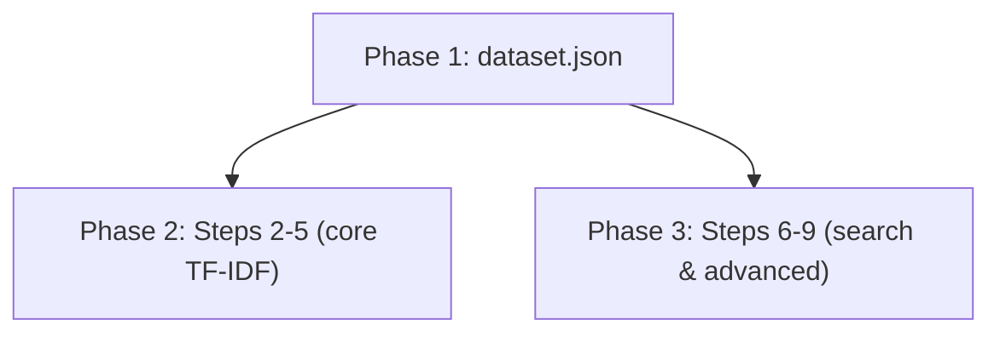

# TF-IDF Demo Scripts Implementation Plan

> **Status:** REVIEWED — ready for execution

## Table of Contents

- [Overview](#overview)
- [Current State Analysis](#current-state-analysis)
- [Desired End State](#desired-end-state)
- [What We're NOT Doing](#what-were-not-doing)
- [File Inventory](#file-inventory)
- [Dependencies](#dependencies)
- [Phase 1: Dataset and Shared Loader](#phase-1-dataset-and-shared-loader)
- [Phase 2: Core TF-IDF Demos (Steps 2–5)](#phase-2-core-tf-idf-demos-steps-25)
- [Phase 3: Search and Advanced Demos (Steps 6–9)](#phase-3-search-and-advanced-demos-steps-69)
- [Testing Strategy](#testing-strategy)

## Overview

Create runnable Python demo scripts in `docs/tfidf/demo/` that walk through every code example from `docs/tfidf/tfidf-guide.md`. Each step becomes a standalone script with `if __name__ == "__main__"`. All scripts load the same mock dataset from a shared JSON file.

## Current State Analysis

- `docs/tfidf/tfidf-guide.md` exists with 9 code steps (Steps 2–9, plus a parameter reference table in Step 10 that has no runnable code).
- `docs/tfidf/demo/` exists as an empty directory (no files yet).
- Project uses `uv` for dependency management. `scikit-learn`, `scipy`, `numpy`, `pandas` need to be available (add if missing).

### Key Discoveries:
- The guide defines 10 mock ICD-10 descriptions and codes inline. These become the JSON dataset.
- Steps 2 (vectorizer vs transformer comparison) through 9 (persistence) each have concrete code blocks.
- Step 5 (parameters) covers 6 sub-topics — these all go in one file with sections.
- Step 10 is a reference table with no runnable code — skip it.

## Desired End State

```
docs/tfidf/demo/
├── dataset.json                  # 10-item mock dataset
├── step02_vectorizer_vs_transformer.py
├── step03_fit_transform.py
├── step04_inspect_output.py
├── step05_key_parameters.py
├── step06_cosine_search.py
├── step07_hybrid_search.py
├── step08_debug_explain.py
└── step09_persistence.py
```

**Success Criteria:**
- [x] `dataset.json` contains 10 dictionaries with keys `description` and `code`
- [x] Every `stepNN_*.py` loads from `dataset.json` (relative to its own directory)
- [x] Every script runs successfully: `uv run python docs/tfidf/demo/stepNN_*.py`
- [x] Every script uses `if __name__ == "__main__":` guard
- [x] Output is self-explanatory with section headers printed to stdout

**How to Verify:**
```bash
for f in docs/tfidf/demo/step*.py; do echo "=== $f ==="; uv run python "$f"; echo; done
```

## What We're NOT Doing

- Not modifying `tfidf-guide.md` itself
- Not adding these scripts to the main `src/` package
- Not writing pytest tests — the scripts are self-demonstrating
- Step 1 (install) and Step 10 (parameter table) have no runnable code — skipped

## Notes

- **Ruff compliance:** All script code in this plan is written to pass `ruff check` and `ruff format` without modification. The project's pre-commit hooks will run automatically on `git commit`; no `--no-verify` bypass is needed.

## File Inventory

| File | Action | Phase | Purpose |
|------|--------|-------|---------|
| `docs/tfidf/demo/dataset.json` | CREATE | 1 | Mock ICD-10 dataset (10 items) |
| `docs/tfidf/demo/step02_vectorizer_vs_transformer.py` | CREATE | 2 | Compare TfidfVectorizer vs CountVectorizer+TfidfTransformer |
| `docs/tfidf/demo/step03_fit_transform.py` | CREATE | 2 | Demonstrate fit, transform, fit_transform |
| `docs/tfidf/demo/step04_inspect_output.py` | CREATE | 2 | Inspect sparse matrix, vocab, IDF, sparsity |
| `docs/tfidf/demo/step05_key_parameters.py` | CREATE | 2 | Demo ngram_range, analyzer, stop_words, min/max_df, sublinear_tf, max_features |
| `docs/tfidf/demo/step06_cosine_search.py` | CREATE | 3 | Cosine similarity search with linear_kernel |
| `docs/tfidf/demo/step07_hybrid_search.py` | CREATE | 3 | Hybrid word + char_wb vectorizer for typo robustness |
| `docs/tfidf/demo/step08_debug_explain.py` | CREATE | 3 | explain_query() debugging utility |
| `docs/tfidf/demo/step09_persistence.py` | CREATE | 3 | Pickle save/load of vectorizer + matrix |

## Implementation Approach

### Execution Flow



### Decision Log

| Decision | Options Considered | Chosen | Rationale |
|----------|-------------------|--------|-----------|
| Dataset format | CSV vs JSON | JSON | User explicitly requested JSON with `description` and `code` keys |
| File naming | `step_N.py` vs `stepNN_name.py` | `stepNN_name.py` | Two-digit numbering sorts correctly; descriptive suffix aids discoverability |
| Dataset loading | each file loads JSON | shared `_load_dataset()` in each file | No shared module needed — each file is fully self-contained |
| Step 5 layout | 6 separate files vs 1 file | 1 file with sections | All parameter demos are short; splitting would be excessive |
| Persistence dir | `data/cache/` vs temp dir | `tempfile` | Demo shouldn't write into real project dirs; uses temp dir and cleans up |

## Dependencies

**Execution Order:**
1. Phase 1 — dataset (no dependencies)
2. Phases 2 and 3 — depend on Phase 1, but are independent of each other

**Parallelization:** Phases 2 and 3 can run in parallel after Phase 1.

---

## Prerequisites

Run these steps from the **project root** before starting any phase.

### 0.1: Ensure the demo directory exists

```bash
mkdir -p docs/tfidf/demo/
```

(The directory already exists in the current repo; include this for reproducibility in a clean checkout.)

### 0.2: Install dependencies

```bash
uv sync
```

Verify the key packages are available:

```bash
uv run python -c "import sklearn, scipy, numpy, pandas; print('all dependencies OK')"
```

### 0.3: Confirm working directory

All commands in this plan must be run from the **project root** (`anthuria-project/`). Verify:

```bash
ls pyproject.toml   # should exist
```

---

## Phase 1: Dataset and Shared Loader

### Overview
Create the JSON dataset file that all demo scripts load.

### Context
Before starting, read: `docs/tfidf/tfidf-guide.md` lines 29–48 (the mock dataset definition).

### Dependencies
**Depends on:** None
**Required by:** Phase 2, Phase 3

### Changes Required

#### 1.1: Create dataset.json
**File:** `docs/tfidf/demo/dataset.json`
**Action:** CREATE

**What this does:** Stores the 10 mock ICD-10 items as a JSON array of objects.

```json
[
  {"description": "acute myocardial infarction of anterior wall", "code": "I21.0"},
  {"description": "acute myocardial infarction of inferior wall", "code": "I21.1"},
  {"description": "chronic ischemic heart disease", "code": "I25.9"},
  {"description": "type 2 diabetes mellitus with diabetic nephropathy", "code": "E11.65"},
  {"description": "type 2 diabetes mellitus without complications", "code": "E11.9"},
  {"description": "essential primary hypertension", "code": "I10"},
  {"description": "hypertensive chronic kidney disease", "code": "I12.9"},
  {"description": "chronic obstructive pulmonary disease unspecified", "code": "J44.1"},
  {"description": "pneumonia due to streptococcus pneumoniae", "code": "J13"},
  {"description": "asthma mild intermittent uncomplicated", "code": "J45.20"}
]
```

### Success Criteria

#### Automated Verification:
- [x] File is valid JSON: `uv run python -c "import json, pathlib; json.loads(pathlib.Path('docs/tfidf/demo/dataset.json').read_text())"`
- [x] Contains 10 items, each with `description` and `code` keys:
  ```bash
  uv run python -c "
  import json, pathlib
  d = json.loads(pathlib.Path('docs/tfidf/demo/dataset.json').read_text())
  assert len(d) == 10, f'Expected 10 items, got {len(d)}'
  assert all('description' in x and 'code' in x for x in d), 'Missing keys'
  print('dataset.json OK: 10 items, all have description+code')
  "
  ```

---

## Phase 2: Core TF-IDF Demos (Steps 2–5)

### Overview
Create demo scripts for the foundational TF-IDF concepts: vectorizer comparison, fit/transform mechanics, output inspection, and parameter exploration.

### Context
Before starting, read:
- `docs/tfidf/tfidf-guide.md` — the full guide (already read)
- `docs/tfidf/demo/dataset.json` — the dataset (created in Phase 1)

### Dependencies
**Depends on:** Phase 1
**Required by:** None

### Changes Required

#### 2.1: step02_vectorizer_vs_transformer.py
**File:** `docs/tfidf/demo/step02_vectorizer_vs_transformer.py`
**Action:** CREATE

**What this does:** Shows TfidfVectorizer (one-step) vs CountVectorizer+TfidfTransformer (two-step) produce identical results.

```python
"""Step 2: TfidfVectorizer vs CountVectorizer + TfidfTransformer.

Demonstrates that TfidfVectorizer is a convenience wrapper that combines
CountVectorizer and TfidfTransformer into a single object. Both approaches
produce identical TF-IDF matrices.
"""

import json
from pathlib import Path

import numpy as np
from sklearn.feature_extraction.text import (
    CountVectorizer,
    TfidfTransformer,
    TfidfVectorizer,
)


def load_dataset() -> tuple[list[str], list[str]]:
    data = json.loads((Path(__file__).parent / "dataset.json").read_text())
    return [d["description"] for d in data], [d["code"] for d in data]


def main() -> None:
    descriptions, codes = load_dataset()

    # --- Approach A: TfidfVectorizer (one step) ---
    print("=== Approach A: TfidfVectorizer (one step) ===")
    vectorizer = TfidfVectorizer()
    matrix_a = vectorizer.fit_transform(descriptions)
    print(f"Shape: {matrix_a.shape}")
    print(f"Type:  {type(matrix_a)}")

    # --- Approach B: CountVectorizer + TfidfTransformer (two steps) ---
    print("\n=== Approach B: CountVectorizer + TfidfTransformer (two steps) ===")
    count_vec = CountVectorizer()
    count_matrix = count_vec.fit_transform(descriptions)
    print(f"Count matrix shape: {count_matrix.shape}")

    tfidf_transformer = TfidfTransformer(smooth_idf=True, sublinear_tf=False)
    matrix_b = tfidf_transformer.fit_transform(count_matrix)
    print(f"TF-IDF matrix shape: {matrix_b.shape}")

    # --- Verify they produce the same result ---
    print("\n=== Comparison ===")
    diff = np.abs(matrix_a.toarray() - matrix_b.toarray()).max()
    print(f"Max difference between approaches: {diff:.2e}")
    print(f"Identical (within float tolerance): {diff < 1e-10}")


if __name__ == "__main__":
    main()
```

#### 2.2: step03_fit_transform.py
**File:** `docs/tfidf/demo/step03_fit_transform.py`
**Action:** CREATE

**What this does:** Demonstrates the three core methods (fit, transform, fit_transform) and the critical rule about not calling fit_transform on queries.

```python
"""Step 3: fit(), transform(), and fit_transform().

Shows the three core methods and why you must use transform() (not
fit_transform()) on new queries after fitting on the corpus.
"""

import json
from pathlib import Path

import numpy as np
from sklearn.feature_extraction.text import TfidfVectorizer


def load_dataset() -> tuple[list[str], list[str]]:
    data = json.loads((Path(__file__).parent / "dataset.json").read_text())
    return [d["description"] for d in data], [d["code"] for d in data]


def main() -> None:
    descriptions, codes = load_dataset()

    # --- fit() then transform() separately ---
    print("=== fit() then transform() ===")
    v1 = TfidfVectorizer()
    v1.fit(descriptions)
    matrix1 = v1.transform(descriptions)
    print(f"Vocabulary size: {len(v1.vocabulary_)}")
    print(f"Matrix shape:    {matrix1.shape}")
    print(f"Matrix type:     {type(matrix1)}")

    # --- fit_transform() in one pass ---
    print("\n=== fit_transform() (one pass) ===")
    v2 = TfidfVectorizer()
    matrix2 = v2.fit_transform(descriptions)
    print(f"Vocabulary size: {len(v2.vocabulary_)}")
    print(f"Matrix shape:    {matrix2.shape}")

    # --- Verify identical ---
    diff = np.abs(matrix1.toarray() - matrix2.toarray()).max()
    print(f"\nMax difference: {diff:.2e} (should be ~0)")

    # --- Critical rule: transform() for queries ---
    print("\n=== Querying with transform() ===")
    query = "myocardial infarction"
    query_vec = v2.transform([query])
    print(f"Query vector shape: {query_vec.shape}  (1 doc x {query_vec.shape[1]} features)")
    print(f"Non-zero features:  {query_vec.nnz}")

    # --- What goes wrong with fit_transform() on a query ---
    print("\n=== BAD: fit_transform() on a query (don't do this!) ===")
    v_bad = TfidfVectorizer()
    bad_vec = v_bad.fit_transform([query])
    print(f"Bad vector shape:  {bad_vec.shape}  (only {bad_vec.shape[1]} features!)")
    print(f"Corpus had {matrix2.shape[1]} features — the query vector is incompatible")


if __name__ == "__main__":
    main()
```

#### 2.3: step04_inspect_output.py
**File:** `docs/tfidf/demo/step04_inspect_output.py`
**Action:** CREATE

**What this does:** Inspects the sparse matrix output — vocabulary, IDF weights, dense view, sparsity, per-document terms.

```python
"""Step 4: Inspecting the TF-IDF output.

Explores the sparse matrix, vocabulary, IDF weights, sparsity percentage,
and per-document non-zero terms.
"""

import json
from pathlib import Path

import pandas as pd
from sklearn.feature_extraction.text import TfidfVectorizer


def load_dataset() -> tuple[list[str], list[str]]:
    data = json.loads((Path(__file__).parent / "dataset.json").read_text())
    return [d["description"] for d in data], [d["code"] for d in data]


def main() -> None:
    descriptions, codes = load_dataset()

    vectorizer = TfidfVectorizer()
    X = vectorizer.fit_transform(descriptions)

    # --- Vocabulary ---
    features = vectorizer.get_feature_names_out()
    print("=== Vocabulary (first 15 tokens) ===")
    print(features[:15])
    print(f"Total features: {len(features)}")

    # --- IDF weights ---
    print("\n=== IDF Weights (most common → rarest) ===")
    idf_series = pd.Series(vectorizer.idf_, index=features).sort_values()
    print("Lowest IDF (most common):")
    print(idf_series.head())
    print("\nHighest IDF (rarest):")
    print(idf_series.tail())

    # --- Dense view ---
    print("\n=== Dense TF-IDF Matrix ===")
    dense = X.toarray()
    df = pd.DataFrame(dense, columns=features, index=codes)
    print(df.round(3).to_string())

    # --- Sparsity ---
    total = X.shape[0] * X.shape[1]
    print(f"\n=== Sparsity ===")
    print(f"Shape: {X.shape}")
    print(f"Non-zero entries: {X.nnz} / {total}")
    print(f"Sparsity: {1 - X.nnz / total:.1%}")

    # --- Non-zero terms for first document ---
    print(f"\n=== Non-zero terms for doc 0: '{descriptions[0]}' ===")
    doc_vec = X[0]
    for col in doc_vec.nonzero()[1]:
        print(f"  {features[col]:>20s}: {doc_vec[0, col]:.4f}")


if __name__ == "__main__":
    main()
```

#### 2.4: step05_key_parameters.py
**File:** `docs/tfidf/demo/step05_key_parameters.py`
**Action:** CREATE

**What this does:** Demonstrates all 6 key parameters with before/after comparisons.

```python
"""Step 5: Key TfidfVectorizer parameters.

Demonstrates ngram_range, analyzer, stop_words, min_df/max_df,
sublinear_tf, and max_features with concrete before/after output.
"""

import json
from pathlib import Path

from sklearn.feature_extraction.text import ENGLISH_STOP_WORDS, TfidfVectorizer


def load_dataset() -> tuple[list[str], list[str]]:
    data = json.loads((Path(__file__).parent / "dataset.json").read_text())
    return [d["description"] for d in data], [d["code"] for d in data]


def main() -> None:
    descriptions, codes = load_dataset()

    # =============================================
    # ngram_range
    # =============================================
    print("=" * 60)
    print("ngram_range — single words vs phrases")
    print("=" * 60)

    subset = ["type 2 diabetes mellitus", "diabetes mellitus type 1"]

    v1 = TfidfVectorizer(ngram_range=(1, 1))
    v1.fit(subset)
    print(f"\n(1,1) unigrams only:  {list(v1.get_feature_names_out())}")

    v2 = TfidfVectorizer(ngram_range=(1, 2))
    v2.fit(subset)
    print(f"(1,2) uni+bigrams:    {list(v2.get_feature_names_out())}")

    v3 = TfidfVectorizer(ngram_range=(1, 3))
    v3.fit(subset)
    print(f"(1,3) uni+bi+trigrams: {list(v3.get_feature_names_out())}")

    # Full dataset comparison
    v_uni = TfidfVectorizer(ngram_range=(1, 1))
    v_bi = TfidfVectorizer(ngram_range=(1, 2))
    v_uni.fit(descriptions)
    v_bi.fit(descriptions)
    print(f"\nFull dataset — unigrams: {len(v_uni.get_feature_names_out())} features")
    print(f"Full dataset — uni+bi:   {len(v_bi.get_feature_names_out())} features")

    # =============================================
    # analyzer
    # =============================================
    print("\n" + "=" * 60)
    print("analyzer — word vs char_wb")
    print("=" * 60)

    word_vec = TfidfVectorizer(analyzer="word")
    word_vec.fit(descriptions)
    print(f"\nanalyzer='word':    {len(word_vec.get_feature_names_out())} features")
    print(f"  Sample: {list(word_vec.get_feature_names_out()[:8])}")

    char_vec = TfidfVectorizer(analyzer="char_wb", ngram_range=(3, 5))
    char_vec.fit(descriptions)
    print(f"\nanalyzer='char_wb': {len(char_vec.get_feature_names_out())} features")
    print(f"  Sample: {list(char_vec.get_feature_names_out()[:8])}")

    # =============================================
    # stop_words
    # =============================================
    print("\n" + "=" * 60)
    print("stop_words — removing noise words")
    print("=" * 60)

    v_no_stop = TfidfVectorizer(stop_words=None)
    v_no_stop.fit(descriptions)
    feats_no_stop = set(v_no_stop.get_feature_names_out())

    v_en_stop = TfidfVectorizer(stop_words="english")
    v_en_stop.fit(descriptions)
    feats_en_stop = set(v_en_stop.get_feature_names_out())

    removed = feats_no_stop - feats_en_stop
    print(f"\nWithout stop_words: {len(feats_no_stop)} features")
    print(f"With stop_words='english': {len(feats_en_stop)} features")
    print(f"Removed: {sorted(removed)}")

    # Custom medical stop words
    medical_noise = ["unspecified", "elsewhere", "classified", "other"]
    combined = list(ENGLISH_STOP_WORDS.union(medical_noise))
    v_custom = TfidfVectorizer(stop_words=combined)
    v_custom.fit(descriptions)
    print(f"With custom medical stops: {len(v_custom.get_feature_names_out())} features")

    # =============================================
    # min_df and max_df
    # =============================================
    print("\n" + "=" * 60)
    print("min_df / max_df — frequency filtering")
    print("=" * 60)

    for min_df_val in [1, 2, 3]:
        v = TfidfVectorizer(min_df=min_df_val)
        v.fit(descriptions)
        print(f"  min_df={min_df_val}: {len(v.get_feature_names_out())} features")

    for max_df_val in [1.0, 0.5, 0.3]:
        v = TfidfVectorizer(max_df=max_df_val)
        v.fit(descriptions)
        print(f"  max_df={max_df_val}: {len(v.get_feature_names_out())} features")

    # =============================================
    # sublinear_tf
    # =============================================
    print("\n" + "=" * 60)
    print("sublinear_tf — dampening term frequency")
    print("=" * 60)

    v_linear = TfidfVectorizer(sublinear_tf=False)
    v_sublin = TfidfVectorizer(sublinear_tf=True)
    X_lin = v_linear.fit_transform(descriptions)
    X_sub = v_sublin.fit_transform(descriptions)

    # Compare first document's vectors
    feats = v_linear.get_feature_names_out()
    doc0_lin = X_lin[0].toarray().flatten()
    doc0_sub = X_sub[0].toarray().flatten()

    print(f"\nDoc 0: '{descriptions[0]}'")
    for i, feat in enumerate(feats):
        if doc0_lin[i] > 0 or doc0_sub[i] > 0:
            print(f"  {feat:>20s}:  linear={doc0_lin[i]:.4f}  sublinear={doc0_sub[i]:.4f}")

    # =============================================
    # max_features
    # =============================================
    print("\n" + "=" * 60)
    print("max_features — vocabulary size cap")
    print("=" * 60)

    for max_f in [5, 10, 20, None]:
        v = TfidfVectorizer(max_features=max_f)
        v.fit(descriptions)
        feats = v.get_feature_names_out()
        label = str(max_f) if max_f else "None (all)"
        print(f"  max_features={label:>10s}: {len(feats)} features → {list(feats[:6])}...")


if __name__ == "__main__":
    main()
```

### Success Criteria

#### Automated Verification:
- [x] All 4 scripts run without error:
  ```bash
  uv run python docs/tfidf/demo/step02_vectorizer_vs_transformer.py
  uv run python docs/tfidf/demo/step03_fit_transform.py
  uv run python docs/tfidf/demo/step04_inspect_output.py
  uv run python docs/tfidf/demo/step05_key_parameters.py
  ```
- [x] Output-content spot checks:
  ```bash
  uv run python docs/tfidf/demo/step02_vectorizer_vs_transformer.py | grep -q "Identical (within float tolerance): True"
  uv run python docs/tfidf/demo/step03_fit_transform.py | grep -q "Max difference:"
  uv run python docs/tfidf/demo/step04_inspect_output.py | grep -q "Sparsity:"
  uv run python docs/tfidf/demo/step05_key_parameters.py | grep -q "ngram_range"
  ```

---

## Phase 3: Search and Advanced Demos (Steps 6–9)

### Overview
Create demo scripts for cosine similarity search, hybrid vectorizers, query debugging, and persistence.

### Context
Before starting, read:
- `docs/tfidf/tfidf-guide.md` — Steps 6–9
- `docs/tfidf/demo/dataset.json`

### Dependencies
**Depends on:** Phase 1
**Required by:** None

### Changes Required

#### 3.1: step06_cosine_search.py
**File:** `docs/tfidf/demo/step06_cosine_search.py`
**Action:** CREATE

**What this does:** Full search function using TfidfVectorizer + linear_kernel, with multiple query examples.

```python
"""Step 6: Cosine similarity search with linear_kernel.

Builds a search function that vectorizes a query and ranks all corpus
documents by cosine similarity. Uses linear_kernel (equivalent to
cosine_similarity when vectors are L2-normalized).
"""

import json
from pathlib import Path

from sklearn.feature_extraction.text import TfidfVectorizer
from sklearn.metrics.pairwise import linear_kernel


def load_dataset() -> tuple[list[str], list[str]]:
    data = json.loads((Path(__file__).parent / "dataset.json").read_text())
    return [d["description"] for d in data], [d["code"] for d in data]


def main() -> None:
    descriptions, codes = load_dataset()

    # Fit on corpus
    vectorizer = TfidfVectorizer(ngram_range=(1, 2), stop_words="english")
    corpus_matrix = vectorizer.fit_transform(descriptions)
    print(f"Corpus: {corpus_matrix.shape[0]} docs, {corpus_matrix.shape[1]} features\n")

    def search(query: str, top_k: int = 5) -> list[dict]:
        """Return top_k most relevant codes for a query."""
        query_vec = vectorizer.transform([query])
        scores = linear_kernel(query_vec, corpus_matrix).flatten()
        top_indices = scores.argsort()[-top_k:][::-1]
        return [
            {
                "rank": rank + 1,
                "code": codes[idx],
                "description": descriptions[idx],
                "score": round(float(scores[idx]), 4),
            }
            for rank, idx in enumerate(top_indices)
            if scores[idx] > 0
        ]

    # --- Run several queries ---
    queries = [
        "myocardial infarction",
        "diabetes mellitus",
        "chronic kidney disease",
        "heart attack",           # synonym — not in vocabulary
        "pulmonary disease",
        "hypertension",
    ]

    for query in queries:
        results = search(query)
        print(f"Query: '{query}'")
        if results:
            for r in results[:3]:
                print(f"  {r['rank']}. [{r['code']}] {r['description']}  (score={r['score']})")
        else:
            print("  (no matches)")
        print()


if __name__ == "__main__":
    main()
```

#### 3.2: step07_hybrid_search.py
**File:** `docs/tfidf/demo/step07_hybrid_search.py`
**Action:** CREATE

**What this does:** Combines word-level and character-level vectorizers via scipy hstack for typo-robust search.

```python
"""Step 7: Hybrid word + character n-gram search.

Combines a word-level TfidfVectorizer (semantic meaning) with a char_wb
vectorizer (typo robustness) by horizontally stacking their sparse matrices.
"""

import json
from pathlib import Path

from scipy.sparse import hstack
from sklearn.feature_extraction.text import TfidfVectorizer
from sklearn.metrics.pairwise import linear_kernel


def load_dataset() -> tuple[list[str], list[str]]:
    data = json.loads((Path(__file__).parent / "dataset.json").read_text())
    return [d["description"] for d in data], [d["code"] for d in data]


def main() -> None:
    descriptions, codes = load_dataset()

    # Two vectorizers: word-level + character-level
    word_vec = TfidfVectorizer(analyzer="word", ngram_range=(1, 2), stop_words="english")
    char_vec = TfidfVectorizer(analyzer="char_wb", ngram_range=(3, 5))

    word_matrix = word_vec.fit_transform(descriptions)
    char_matrix = char_vec.fit_transform(descriptions)
    combined_matrix = hstack([word_matrix, char_matrix])

    print(f"Word features:     {word_matrix.shape[1]}")
    print(f"Char features:     {char_matrix.shape[1]}")
    print(f"Combined features: {combined_matrix.shape[1]}\n")

    def search_hybrid(query: str, top_k: int = 5) -> list[dict]:
        q = hstack([word_vec.transform([query]), char_vec.transform([query])])
        scores = linear_kernel(q, combined_matrix).flatten()
        top_indices = scores.argsort()[-top_k:][::-1]
        return [
            {
                "code": codes[i],
                "description": descriptions[i],
                "score": round(float(scores[i]), 4),
            }
            for i in top_indices
            if scores[i] > 0
        ]

    # --- Compare: correct spelling vs typos ---
    test_queries = [
        ("myocardial infarction", "correct spelling"),
        ("myocardal infarcton", "typos in both words"),
        ("diabtes kidney", "partial + misspelled"),
        ("pnuemonia streptococcus", "misspelled pneumonia"),
        ("asthma", "exact match"),
    ]

    for query, note in test_queries:
        results = search_hybrid(query)
        print(f"Query: '{query}' ({note})")
        for r in results[:3]:
            print(f"  [{r['code']}] {r['description']}  (score={r['score']})")
        print()


if __name__ == "__main__":
    main()
```

#### 3.3: step08_debug_explain.py
**File:** `docs/tfidf/demo/step08_debug_explain.py`
**Action:** CREATE

**What this does:** Provides an `explain_query()` function to see which tokens matched and their TF-IDF/IDF scores.

```python
"""Step 8: Debugging — what did the vectorizer see?

Uses explain_query() to show exactly which tokens in a query matched the
learned vocabulary, their TF-IDF weights, and IDF values. Helps diagnose
why a query did or didn't match.
"""

import json
from pathlib import Path

from sklearn.feature_extraction.text import TfidfVectorizer


def load_dataset() -> tuple[list[str], list[str]]:
    data = json.loads((Path(__file__).parent / "dataset.json").read_text())
    return [d["description"] for d in data], [d["code"] for d in data]


def explain_query(vectorizer: TfidfVectorizer, query: str) -> None:
    """Print which query tokens matched the vocabulary and their weights."""
    vec = vectorizer.transform([query])
    features = vectorizer.get_feature_names_out()
    nonzero = vec.nonzero()[1]
    print(f"Query: '{query}' → {len(nonzero)} matched feature(s)")
    for col in nonzero:
        print(f"  '{features[col]}':  tfidf={vec[0, col]:.4f}  idf={vectorizer.idf_[col]:.4f}")
    if len(nonzero) == 0:
        print("  (no terms in query match the vocabulary — all scores will be 0)")


def main() -> None:
    descriptions, codes = load_dataset()

    vectorizer = TfidfVectorizer(ngram_range=(1, 2), stop_words="english")
    vectorizer.fit_transform(descriptions)

    print("=== Queries that MATCH vocabulary ===\n")
    explain_query(vectorizer, "myocardial infarction anterior")
    print()
    explain_query(vectorizer, "diabetes mellitus")
    print()
    explain_query(vectorizer, "chronic disease")
    print()

    print("=== Queries that DON'T match (synonyms/slang) ===\n")
    explain_query(vectorizer, "heart attack")
    print()
    explain_query(vectorizer, "sugar disease")
    print()
    explain_query(vectorizer, "high blood pressure")
    print()

    print("=== Partial matches ===\n")
    explain_query(vectorizer, "acute myocardial something unknown")
    print()
    explain_query(vectorizer, "type 2 diabetes with renal failure")


if __name__ == "__main__":
    main()
```

#### 3.4: step09_persistence.py
**File:** `docs/tfidf/demo/step09_persistence.py`
**Action:** CREATE

**What this does:** Demonstrates pickle save/load of a fitted vectorizer and corpus matrix, using a temp directory so the demo is self-contained.

```python
"""Step 9: Persisting a fitted vectorizer.

Demonstrates saving and loading a fitted TfidfVectorizer and corpus matrix
with pickle, so you don't re-fit on every startup. Uses a temp directory
to keep the demo self-contained.
"""

import json
import pickle
import tempfile
from pathlib import Path

from sklearn.feature_extraction.text import TfidfVectorizer
from sklearn.metrics.pairwise import linear_kernel


def load_dataset() -> tuple[list[str], list[str]]:
    data = json.loads((Path(__file__).parent / "dataset.json").read_text())
    return [d["description"] for d in data], [d["code"] for d in data]


def main() -> None:
    descriptions, codes = load_dataset()

    # --- Fit the vectorizer ---
    print("=== Fitting vectorizer ===")
    vectorizer = TfidfVectorizer(ngram_range=(1, 2), stop_words="english")
    corpus_matrix = vectorizer.fit_transform(descriptions)
    print(f"Vocabulary size: {len(vectorizer.vocabulary_)}")
    print(f"Matrix shape:    {corpus_matrix.shape}")

    # --- Save to disk ---
    with tempfile.TemporaryDirectory() as tmpdir:
        cache_dir = Path(tmpdir)
        vec_path = cache_dir / "vectorizer.pkl"
        mat_path = cache_dir / "corpus_matrix.pkl"

        print(f"\n=== Saving to {cache_dir} ===")
        with open(vec_path, "wb") as f:
            pickle.dump(vectorizer, f)
        with open(mat_path, "wb") as f:
            pickle.dump(corpus_matrix, f)

        print(f"vectorizer.pkl:    {vec_path.stat().st_size:,} bytes")
        print(f"corpus_matrix.pkl: {mat_path.stat().st_size:,} bytes")

        # --- Load from disk (simulating a fresh process) ---
        print("\n=== Loading from disk ===")
        with open(vec_path, "rb") as f:
            loaded_vec = pickle.load(f)
        with open(mat_path, "rb") as f:
            loaded_matrix = pickle.load(f)

        print(f"Loaded vocabulary size: {len(loaded_vec.vocabulary_)}")
        print(f"Loaded matrix shape:    {loaded_matrix.shape}")

        # --- Search using loaded objects (no re-fitting) ---
        print("\n=== Search with loaded vectorizer ===")
        query = "diabetes with kidney complications"
        query_vec = loaded_vec.transform([query])
        scores = linear_kernel(query_vec, loaded_matrix).flatten()
        top_indices = scores.argsort()[-3:][::-1]

        print(f"Query: '{query}'")
        for idx in top_indices:
            if scores[idx] > 0:
                print(f"  [{codes[idx]}] {descriptions[idx]}  (score={scores[idx]:.4f})")

    print("\n(temp directory cleaned up)")


if __name__ == "__main__":
    main()
```

### Success Criteria

#### Automated Verification:
- [x] All 4 scripts run without error:
  ```bash
  uv run python docs/tfidf/demo/step06_cosine_search.py
  uv run python docs/tfidf/demo/step07_hybrid_search.py
  uv run python docs/tfidf/demo/step08_debug_explain.py
  uv run python docs/tfidf/demo/step09_persistence.py
  ```
- [x] Output-content spot checks:
  ```bash
  uv run python docs/tfidf/demo/step06_cosine_search.py | grep -q "(no matches)"
  uv run python docs/tfidf/demo/step07_hybrid_search.py | grep -q "Combined features:"
  uv run python docs/tfidf/demo/step08_debug_explain.py | grep -q "matched feature"
  uv run python docs/tfidf/demo/step09_persistence.py | grep -q "temp directory cleaned up"
  ```

---

## Testing Strategy

### Automated Tests:
Run all scripts in sequence from project root:
```bash
for f in docs/tfidf/demo/step*.py; do echo "=== $f ==="; uv run python "$f"; echo; done
```

### Manual Verification:
- [ ] Each script prints section headers that match the guide's step descriptions
- [ ] Output is self-explanatory without reading the guide
- [ ] step06 shows "heart attack" returning no results (demonstrating the synonym limitation)
- [ ] step07 shows typo queries still finding relevant results
- [ ] step08 clearly shows matched vs unmatched vocabulary terms

## References

- Source guide: `docs/tfidf/tfidf-guide.md`
- scikit-learn TfidfVectorizer docs: https://scikit-learn.org/stable/modules/generated/sklearn.feature_extraction.text.TfidfVectorizer.html
