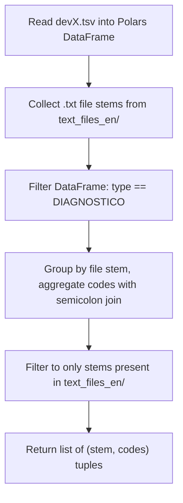

# CodiEsp Diagnosis Code Extraction Pipeline

> **Status:** DRAFT

## Table of Contents

- [Overview](#overview)
- [Current State Analysis](#current-state-analysis)
- [Desired End State](#desired-end-state)
- [What We're NOT Doing](#what-were-not-doing)
- [File Inventory](#file-inventory)
- [Implementation Approach](#implementation-approach)
- [Dependencies](#dependencies)
- [Phase 1: Create the Pipeline Script](#phase-1-create-the-pipeline-script)
- [Testing Strategy](#testing-strategy)
- [References](#references)

## Overview

Create a Polars-based data processing script that extracts ICD-10 diagnosis codes from the CodiEsp dataset. For each clinical text file in the `text_files_en/` directory, the script filters the `devX.tsv` file to rows matching the file's stem and type `DIAGNOSTICO`, then returns a tuple of `(file_stem, semicolon_joined_codes)`.

## Current State Analysis

### Data Structure

**`devX.tsv`** — tab-separated, **no header row**, 5 columns:

| Column Index | Content | Example |
|---|---|---|
| 0 | File stem (matches `.txt` filename without extension) | `S0004-06142005000900016-1` |
| 1 | Type: `DIAGNOSTICO` or `PROCEDIMIENTO` | `DIAGNOSTICO` |
| 2 | ICD code | `q62.11` |
| 3 | Description (Spanish) | `estenosis en la unión pieloureteral derecha` |
| 4 | Character span offsets | `540 583` |

**`text_files_en/`** — 250 `.txt` files containing English clinical case text.

### Key Discoveries

- `devX.tsv` has no header — must use `has_header=False` and assign column names manually
- A single file stem can have duplicate codes (e.g., `q62.11` appears twice for the example file) — these duplicates should be preserved in the output
- Polars `>=1.38.1` is already in `pyproject.toml`
- Existing scripts live in `src/scripts/`

## Desired End State

A script at `src/scripts/parse_codiesp.py` that:

1. Reads `devX.tsv` once into a Polars DataFrame
2. Collects all `.txt` file stems from `text_files_en/`
3. For each file stem, filters to rows where `col1 == stem` and `col2 == "DIAGNOSTICO"`
4. Returns a `list[tuple[str, str]]` where each tuple is `(file_stem, semicolon_joined_codes)`
5. Can be run via `uv run python src/scripts/parse_codiesp.py`

**Success Criteria:**
- [ ] Running the script produces output for all 250 files
- [ ] For file stem `S0004-06142005000900016-1`, the output is `("S0004-06142005000900016-1", "q62.11;n28.89;n39.0;r31.9;n23;n28.0;q62.11;d18.09;n13.5;k26.9;n28.9;n20.0;k59.00")`
- [ ] Files with no DIAGNOSTICO rows are skipped (not included in output)
- [ ] `uv run ruff check src/scripts/parse_codiesp.py` passes
- [ ] `uv run ruff format --check src/scripts/parse_codiesp.py` passes

## What We're NOT Doing

- Not reading or processing the `.txt` file contents — only using file stems
- Not processing `PROCEDIMIENTO` rows
- Not deduplicating codes within a file (duplicates are preserved per the example)
- Not processing `devD.tsv` or `devP.tsv`
- Not adding tests in this phase (verification is via the known example output)

## File Inventory

| File | Action | Phase | Purpose |
|------|--------|-------|---------|
| `src/scripts/parse_codiesp.py` | CREATE | 1 | Pipeline script |

## Implementation Approach

### Execution Flow



### Decision Log

| Decision | Options Considered | Chosen | Rationale |
|----------|-------------------|--------|-----------|
| Filtering strategy | Per-file loop vs. single group_by | Single group_by | Polars is optimized for bulk operations; grouping once is O(n) vs O(n*m) for per-file filtering |
| Duplicate handling | Deduplicate vs. preserve | Preserve | User's example output contains duplicate `q62.11`, confirming duplicates should stay |
| Output format | Print to stdout vs. return list | Both — function returns list, `__main__` prints | Reusable as import AND runnable as script |

## Dependencies

Single phase — no inter-phase dependencies.

---

## Phase 1: Create the Pipeline Script

### Overview

Create `src/scripts/parse_codiesp.py` with a Polars pipeline that reads `devX.tsv`, filters to DIAGNOSTICO rows, groups by file stem, and returns `(stem, codes)` tuples.

### Context

Before starting, read these files:
- `src/scripts/enrich_codes.py` — existing script pattern for reference
- `data/test-datasets/codiesp/gold/final_dataset_v4_to_publish/dev/devX.tsv` — the input TSV (first 5 lines only, to confirm structure)

### Dependencies

**Depends on:** None
**Required by:** Nothing

### Changes Required

#### 1.1: Create `src/scripts/parse_codiesp.py`

**File:** `src/scripts/parse_codiesp.py`
**Action:** CREATE

**What this does:** Reads devX.tsv with Polars, filters to DIAGNOSTICO rows for files present in text_files_en/, groups by stem, and joins codes with semicolons.

```python
"""Extract diagnosis codes from CodiEsp devX.tsv for each clinical text file."""

from pathlib import Path

import polars as pl

DEV_DIR = Path("data/test-datasets/codiesp/gold/final_dataset_v4_to_publish/dev")
TSV_PATH = DEV_DIR / "devX.tsv"
TEXT_DIR = DEV_DIR / "text_files_en"

COLUMN_NAMES = ["file_stem", "type", "code", "description", "span"]


def parse_codiesp_diagnostics() -> list[tuple[str, str]]:
    """Parse devX.tsv and return (file_stem, semicolon_joined_codes) for each text file.

    Only rows with type == "DIAGNOSTICO" are included. Files with no
    DIAGNOSTICO rows are omitted from the result.
    """
    # Collect file stems from the text_files_en directory
    text_stems = {p.stem for p in TEXT_DIR.glob("*.txt")}

    # Read TSV and filter in one pipeline
    df = (
        pl.read_csv(
            TSV_PATH,
            separator="\t",
            has_header=False,
            new_columns=COLUMN_NAMES,
        )
        .filter(
            pl.col("type").eq("DIAGNOSTICO")
            & pl.col("file_stem").is_in(list(text_stems))
        )
        .group_by("file_stem", maintain_order=True)
        .agg(pl.col("code").str.concat(";").alias("codes"))
    )

    return list(zip(df["file_stem"].to_list(), df["codes"].to_list(), strict=True))


if __name__ == "__main__":
    results = parse_codiesp_diagnostics()
    for stem, codes in results:
        print(f"({stem},{codes!r})")
```

### Success Criteria

#### Automated Verification:
- [ ] Script runs without error: `uv run python src/scripts/parse_codiesp.py`
- [ ] Linting passes: `uv run ruff check src/scripts/parse_codiesp.py`
- [ ] Formatting passes: `uv run ruff format --check src/scripts/parse_codiesp.py`
- [ ] Output for `S0004-06142005000900016-1` matches expected codes: `q62.11;n28.89;n39.0;r31.9;n23;n28.0;q62.11;d18.09;n13.5;k26.9;n28.9;n20.0;k59.00`
- [ ] Output contains entries (not empty)

#### Manual Verification:
- [ ] Spot-check 2-3 other file stems against `devX.tsv` to confirm correctness
- [ ] Confirm no PROCEDIMIENTO codes leak into output

## Testing Strategy

### Verification Script (run after creation):

```bash
# Run the script and capture output
uv run python src/scripts/parse_codiesp.py > /tmp/codiesp_output.txt

# Check the example case
grep "S0004-06142005000900016-1" /tmp/codiesp_output.txt

# Count output lines (should be <= 250, one per file with DIAGNOSTICO rows)
wc -l /tmp/codiesp_output.txt

# Lint and format check
uv run ruff check src/scripts/parse_codiesp.py
uv run ruff format --check src/scripts/parse_codiesp.py
```

## References

- Input TSV: `data/test-datasets/codiesp/gold/final_dataset_v4_to_publish/dev/devX.tsv`
- Text files: `data/test-datasets/codiesp/gold/final_dataset_v4_to_publish/dev/text_files_en/`
- Similar script pattern: `src/scripts/enrich_codes.py`
