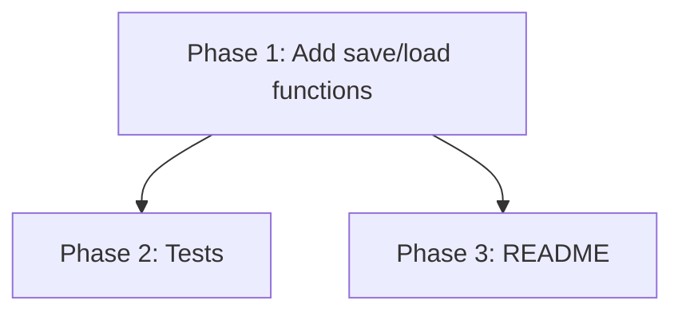

# CodiEsp Parser Save/Load Implementation Plan

> **Status:** DRAFT

## Table of Contents

- [Overview](#overview)
- [Current State Analysis](#current-state-analysis)
- [Desired End State](#desired-end-state)
- [What We're NOT Doing](#what-were-not-doing)
- [File Inventory](#file-inventory)
- [Implementation Approach](#implementation-approach)
- [Dependencies](#dependencies)
- [Phase 1: Add save and load to parse_codiesp.py](#phase-1-add-save-and-load)
- [Phase 2: Tests](#phase-2-tests)
- [Phase 3: README for processed/gold](#phase-3-readme)
- [Testing Strategy](#testing-strategy)
- [References](#references)

## Overview

Add `save_to_parquet` and `load_from_parquet` functions to the CodiEsp parser script so that parsed diagnosis ground-truth data can be persisted as a Parquet file and reloaded without re-parsing the TSV. The output file is `codiesp_ground_truth.parquet` in `data/test-datasets/codiesp/data-pipeline/processed/gold/`.

## Current State Analysis

### Key Discoveries:
- `src/scripts/parse_codiesp.py` (lines 14-38) has a single function `parse_codiesp_diagnostics()` that returns `list[tuple[str, str]]` — pairs of `(file_stem, semicolon_joined_codes)`.
- The project already has a well-established save/load pattern in `src/knowledge_base.py:68-87` using `pl.DataFrame.write_parquet()` and `pl.read_parquet()`.
- Tests in `tests/test_knowledge_base.py` follow a fixture-chain pattern: sample data → save → load → verify round-trip.
- The target output directory already exists: `data/test-datasets/codiesp/data-pipeline/processed/gold/` (currently empty).

## Desired End State

**Success Criteria:**
- [x] `save_to_parquet(results, path)` writes a 2-column Parquet file (`file_stem`, `codes`) from the parsed results
- [x] `load_from_parquet(path)` reads the Parquet file back into `list[tuple[str, str]]`
- [x] Round-trip preserves data exactly
- [x] `__main__` block saves to the default output path
- [x] All tests pass, type checker passes, linter passes
- [x] `README.md` exists in `data/test-datasets/codiesp/data-pipeline/processed/gold/` describing the data pipeline

**How to Verify:**
```bash
uv run pytest tests/test_parse_codiesp.py -v
uv run ty check src/scripts/parse_codiesp.py tests/test_parse_codiesp.py
uv run ruff check src/scripts/parse_codiesp.py tests/test_parse_codiesp.py
```

## What We're NOT Doing

- Not changing `parse_codiesp_diagnostics()` signature or behavior
- Not adding a class wrapper — keeping it as simple module-level functions
- Not adding CLI argument parsing

## File Inventory

| File | Action | Phase | Purpose |
|------|--------|-------|---------|
| `src/scripts/parse_codiesp.py` | MODIFY | 1 | Add `save_to_parquet`, `load_from_parquet`, update `__main__` |
| `tests/test_parse_codiesp.py` | CREATE | 2 | Tests for save/load/round-trip |
| `data/test-datasets/codiesp/data-pipeline/processed/gold/README.md` | CREATE | 3 | Data provenance record for the gold output directory |

## Implementation Approach

### Execution Flow



### Decision Log

| Decision | Options Considered | Chosen | Rationale |
|----------|-------------------|--------|-----------|
| Function style | Class methods vs module functions | Module functions | Script is already function-based, no class to attach to |
| Column names | `file_stem`/`codes` vs `stem`/`icd_codes` | `file_stem`/`codes` | Matches existing variable names in `parse_codiesp_diagnostics` |
| Default output path | Constant vs parameter | Both — constant + parameter override | Matches `__main__` usage while keeping functions reusable |

## Dependencies

**Execution Order:**
1. Phase 1 (no dependencies)
2. Phase 2 (depends on Phase 1)
3. Phase 3 (depends on Phase 1 — needs output path constant; can run in parallel with Phase 2)

**Parallelization:** Phases 2 and 3 can run in parallel once Phase 1 is complete.

---

## Phase 1: Add save and load

### Overview
Add two functions and update the `__main__` block.

### Context
Before starting, read these files:
- `src/scripts/parse_codiesp.py` — current implementation
- `src/knowledge_base.py` lines 68-87 — existing save/load pattern to follow

### Dependencies
**Depends on:** None
**Required by:** Phase 2, Phase 3

### Changes Required

#### 1.1: Add output path constant, `save_to_parquet`, `load_from_parquet`, and update `__main__`

**File:** `src/scripts/parse_codiesp.py`
**Action:** MODIFY

**What this does:** Adds a default output path constant, a function to write results to Parquet, a function to read them back, and updates `__main__` to save after parsing.

**Before** (entire file):
```python
"""Extract diagnosis codes from CodiEsp devX.tsv for each clinical text file."""

from pathlib import Path

import polars as pl

DEV_DIR = Path("data/test-datasets/codiesp/gold/final_dataset_v4_to_publish/dev")
TSV_PATH = DEV_DIR / "devX.tsv"
TEXT_DIR = DEV_DIR / "text_files_en"

COLUMN_NAMES = ["file_stem", "type", "code", "description", "span"]


def parse_codiesp_diagnostics() -> list[tuple[str, str]]:
    """Parse devX.tsv and return (file_stem, semicolon_joined_codes) for each text file.

    Only rows with type == "DIAGNOSTICO" are included. Files with no
    DIAGNOSTICO rows are omitted from the result.
    """
    text_stems = {p.stem for p in TEXT_DIR.glob("*.txt")}

    df = (
        pl.read_csv(
            TSV_PATH,
            separator="\t",
            has_header=False,
            new_columns=COLUMN_NAMES,
        )
        .filter(
            pl.col("type").eq("DIAGNOSTICO")
            & pl.col("file_stem").is_in(list(text_stems))
        )
        .with_columns(pl.col("code").str.to_uppercase().str.replace_all(r"[^\w]", ""))
        .group_by("file_stem", maintain_order=True)
        .agg(pl.col("code").str.join(";").alias("codes"))
    )

    return list(zip(df["file_stem"].to_list(), df["codes"].to_list(), strict=True))


if __name__ == "__main__":
    results = parse_codiesp_diagnostics()
    for stem, codes in results[0:2]:
        print(f"({stem},{codes!r})")
```

**After** (entire file):
```python
"""Extract diagnosis codes from CodiEsp devX.tsv for each clinical text file."""

from pathlib import Path

import polars as pl

DEV_DIR = Path("data/test-datasets/codiesp/gold/final_dataset_v4_to_publish/dev")
TSV_PATH = DEV_DIR / "devX.tsv"
TEXT_DIR = DEV_DIR / "text_files_en"

OUTPUT_PATH = Path(
    "data/test-datasets/codiesp/data-pipeline/processed/gold/codiesp_ground_truth.parquet"
)

COLUMN_NAMES = ["file_stem", "type", "code", "description", "span"]


def parse_codiesp_diagnostics() -> list[tuple[str, str]]:
    """Parse devX.tsv and return (file_stem, semicolon_joined_codes) for each text file.

    Only rows with type == "DIAGNOSTICO" are included. Files with no
    DIAGNOSTICO rows are omitted from the result.
    """
    text_stems = {p.stem for p in TEXT_DIR.glob("*.txt")}

    df = (
        pl.read_csv(
            TSV_PATH,
            separator="\t",
            has_header=False,
            new_columns=COLUMN_NAMES,
        )
        .filter(
            pl.col("type").eq("DIAGNOSTICO")
            & pl.col("file_stem").is_in(list(text_stems))
        )
        .with_columns(pl.col("code").str.to_uppercase().str.replace_all(r"[^\w]", ""))
        .group_by("file_stem", maintain_order=True)
        .agg(pl.col("code").str.join(";").alias("codes"))
    )

    return list(zip(df["file_stem"].to_list(), df["codes"].to_list(), strict=True))


def save_to_parquet(
    results: list[tuple[str, str]], path: Path = OUTPUT_PATH
) -> None:
    """Write parsed results to a Parquet file."""
    path.parent.mkdir(parents=True, exist_ok=True)
    pl.DataFrame(
        {
            "file_stem": [r[0] for r in results],
            "codes": [r[1] for r in results],
        }
    ).write_parquet(path)


def load_from_parquet(path: Path = OUTPUT_PATH) -> list[tuple[str, str]]:
    """Read a previously saved Parquet file back into a list of (file_stem, codes) tuples."""
    df = pl.read_parquet(path)
    return list(
        zip(df["file_stem"].to_list(), df["codes"].to_list(), strict=True)
    )


if __name__ == "__main__":
    results = parse_codiesp_diagnostics()
    for stem, codes in results[0:2]:
        print(f"({stem},{codes!r})")
    save_to_parquet(results)
    print(f"\nSaved {len(results)} entries to {OUTPUT_PATH}")
```

**Rationale:** Follows the same pattern as `KnowledgeBase.save` / `load_from_parquet` but as standalone functions since this script has no class. Default path allows `__main__` to just call `save_to_parquet(results)`.

### Success Criteria

#### Automated Verification:
- [x] Type check passes: `uv run ty check src/scripts/parse_codiesp.py`
- [x] Lint passes: `uv run ruff check src/scripts/parse_codiesp.py`

---

## Phase 2: Tests

### Overview
Add a test file with fixtures and round-trip tests following the project's existing pattern.

### Context
Before starting, read these files:
- `src/scripts/parse_codiesp.py` — the functions under test
- `tests/test_knowledge_base.py` — existing test patterns to follow

**Import path note:** `pyproject.toml` sets `pythonpath = ["src"]` for pytest, so `src/` is the Python root. The correct import is `from scripts.parse_codiesp import ...` (not `from src.scripts...`). This matches the pattern used in `tests/test_knowledge_base.py`.

### Dependencies
**Depends on:** Phase 1
**Required by:** None

### Changes Required

#### 2.1: Create test file

**File:** `tests/test_parse_codiesp.py`
**Action:** CREATE

**What this does:** Tests save/load/round-trip for the CodiEsp parser functions.

**Complete file content:**
```python
"""Tests for CodiEsp parser save/load functionality."""

from pathlib import Path

import polars as pl
import pytest

from scripts.parse_codiesp import load_from_parquet, save_to_parquet

SAMPLE_RESULTS: list[tuple[str, str]] = [
    ("S0010", "M545;M791"),
    ("S0024", "J00;J209"),
    ("S0033", "N390"),
]


@pytest.fixture()
def saved_parquet(tmp_path: Path) -> Path:
    path = tmp_path / "codiesp_ground_truth.parquet"
    save_to_parquet(SAMPLE_RESULTS, path)
    return path


def test_save_creates_file(saved_parquet: Path) -> None:
    assert saved_parquet.exists()
    assert saved_parquet.stat().st_size > 0


def test_save_produces_readable_parquet(saved_parquet: Path) -> None:
    df = pl.read_parquet(saved_parquet)
    assert len(df) == len(SAMPLE_RESULTS)


def test_save_has_expected_columns(saved_parquet: Path) -> None:
    df = pl.read_parquet(saved_parquet)
    assert set(df.columns) == {"file_stem", "codes"}


def test_roundtrip_preserves_count(saved_parquet: Path) -> None:
    loaded = load_from_parquet(saved_parquet)
    assert len(loaded) == len(SAMPLE_RESULTS)


def test_roundtrip_preserves_data(saved_parquet: Path) -> None:
    loaded = load_from_parquet(saved_parquet)
    assert loaded == SAMPLE_RESULTS


def test_roundtrip_preserves_types(saved_parquet: Path) -> None:
    loaded = load_from_parquet(saved_parquet)
    for stem, codes in loaded:
        assert isinstance(stem, str)
        assert isinstance(codes, str)


def test_roundtrip_specific_entry(saved_parquet: Path) -> None:
    loaded = load_from_parquet(saved_parquet)
    stem, codes = loaded[0]
    assert stem == "S0010"
    assert codes == "M545;M791"


def test_save_empty_results(tmp_path: Path) -> None:
    path = tmp_path / "empty.parquet"
    save_to_parquet([], path)
    loaded = load_from_parquet(path)
    assert loaded == []


def test_load_nonexistent_file_raises(tmp_path: Path) -> None:
    with pytest.raises(Exception):
        load_from_parquet(tmp_path / "does_not_exist.parquet")
```

**Rationale:** Follows the fixture-chain pattern from `test_knowledge_base.py`. Tests cover: file creation, readability, column schema, round-trip integrity (count, data, types), spot-check on known entry, and empty-input edge case.

### Success Criteria

#### Automated Verification:
- [x] All tests pass: `uv run pytest tests/test_parse_codiesp.py -v`
- [x] Full suite passes (no regressions): `uv run pytest`
- [x] Type check passes: `uv run ty check src/scripts/parse_codiesp.py tests/test_parse_codiesp.py`
- [x] Lint passes: `uv run ruff check src/scripts/parse_codiesp.py tests/test_parse_codiesp.py`
- [x] Format passes: `uv run ruff format --check src/scripts/parse_codiesp.py tests/test_parse_codiesp.py`

---

## Phase 3: README

### Overview
Create a `README.md` in the gold output directory that records the data provenance: where the source data came from, what processing was applied, the output schema, and how to regenerate the file.

### Context
Before starting, read these files:
- `src/scripts/parse_codiesp.py` — the processing script (after Phase 1 changes) to accurately describe the pipeline

### Dependencies
**Depends on:** Phase 1 (needs the final `OUTPUT_PATH` value and processing details)
**Required by:** None

### Changes Required

#### 3.1: Create README.md

**File:** `data/test-datasets/codiesp/data-pipeline/processed/gold/README.md`
**Action:** CREATE

**What this does:** Documents the data provenance for `codiesp_ground_truth.parquet` so the processing steps can be understood and reproduced without reading the source code.

**Complete file content:**
```markdown
# CodiEsp Ground Truth — Processed Gold Data

## Overview

`codiesp_ground_truth.parquet` is the ground-truth diagnosis code dataset derived from
the CodiEsp dev split. It maps each clinical text file to the semicolon-separated list
of ICD-10-CM diagnosis codes assigned by human annotators.

## Source Data

| Item | Path |
|------|------|
| Annotation TSV | `data/test-datasets/codiesp/gold/final_dataset_v4_to_publish/dev/devX.tsv` |
| Clinical text files | `data/test-datasets/codiesp/gold/final_dataset_v4_to_publish/dev/text_files_en/` |

The CodiEsp dataset was released as part of the IberLEF 2020 shared task on clinical
NLP for Spanish. The `devX.tsv` file contains annotation rows with columns:
`file_stem`, `type`, `code`, `description`, `span`.

## Processing Steps

Performed by `src/scripts/parse_codiesp.py` (run from the project root):

1. **Filter to text files only** — only rows whose `file_stem` matches a `.txt` file
   in `text_files_en/` are retained, discarding any annotations without a corresponding
   text.
2. **Filter to DIAGNOSTICO type** — only rows where `type == "DIAGNOSTICO"` are kept;
   procedure codes and other annotation types are excluded.
3. **Normalize codes** — each code is uppercased and all non-word characters are
   stripped (e.g. dots removed: `"M54.5"` → `"M545"`).
4. **Aggregate per file** — codes for the same `file_stem` are joined with `";"` in
   original row order, producing one row per file.
5. **Save to Parquet** — the result is written via `save_to_parquet()` to this
   directory as `codiesp_ground_truth.parquet`.

## Output Schema

| Column | Type | Description |
|--------|------|-------------|
| `file_stem` | `String` | Filename without extension (e.g. `"S0010"`) |
| `codes` | `String` | Semicolon-separated, normalized ICD-10-CM codes (e.g. `"M545;M791"`) |

## Regenerating

Run from the project root:

```bash
uv run python src/scripts/parse_codiesp.py
```

This overwrites `codiesp_ground_truth.parquet` in this directory.

## Loading in Python

```python
from scripts.parse_codiesp import load_from_parquet

results = load_from_parquet()
# returns list[tuple[str, str]] — [(file_stem, codes), ...]
```
```

**Rationale:** The README is placed alongside the output file so provenance travels with the data. It captures source paths, every transformation step, the output schema, and the exact command to regenerate — sufficient to reproduce the file without reading the script.

### Success Criteria

#### Automated Verification:
- [x] File exists: `uv run python -c "from pathlib import Path; assert Path('data/test-datasets/codiesp/data-pipeline/processed/gold/README.md').exists(), 'README missing'"`

#### Manual Verification:
- [ ] All source paths in the README match the actual paths on disk
- [ ] Processing steps accurately reflect `parse_codiesp_diagnostics()` logic
- [ ] Verify the "IberLEF 2020" citation against `data/test-datasets/codiesp/README.md` (or the dataset's own documentation) before finalising

---

## Testing Strategy

### Unit Tests:
- File creation and non-empty size
- Parquet is readable and has correct schema
- Round-trip preserves count, data equality, and types
- Spot-check specific known entry
- Empty input edge case
- `load_from_parquet` raises on non-existent path

### Manual Testing Steps:
1. Run `uv run python src/scripts/parse_codiesp.py` from project root
2. Verify `data/test-datasets/codiesp/data-pipeline/processed/gold/codiesp_ground_truth.parquet` is created
3. Verify the printed count matches expectations

## References

- Existing pattern: `src/knowledge_base.py:68-87`
- Existing tests: `tests/test_knowledge_base.py:56-150`
- Parser script: `src/scripts/parse_codiesp.py`
