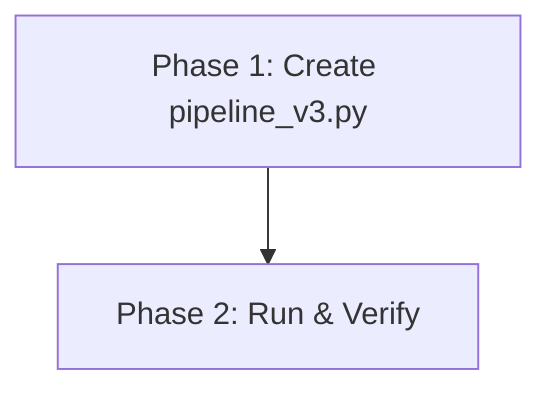
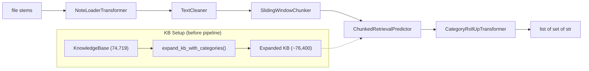

# Multi-Label ICD-10 Retrieval Pipeline v3 — Implementation Plan

> **Status:** DRAFT

## Table of Contents

- [Overview](#overview)
- [Current State Analysis](#current-state-analysis)
- [Desired End State](#desired-end-state)
- [What We're NOT Doing](#what-were-not-doing)
- [File Inventory](#file-inventory)
- [Implementation Approach](#implementation-approach)
- [Dependencies](#dependencies)
- [Phase 1: Create pipeline_v3.py](#phase-1-create-pipeline_v3py)
- [Phase 2: Run Evaluation](#phase-2-run-evaluation)
- [Testing Strategy](#testing-strategy)
- [References](#references)

## Overview

Implement a multi-label ICD-10 retrieval pipeline (`src/pipeline_v3.py`) that processes clinical notes and predicts sets of ICD-10-CM codes. The pipeline combines two strategies for handling 3-character category codes in the CodiEsp ground truth:

1. **Strategy 1 — KB Expansion**: Add ~1,700 non-billable category codes to the KnowledgeBase so the TF-IDF retriever can directly match them.
2. **Strategy 2b — Roll-Up**: Post-prediction step that adds category codes when a child code is predicted and the category is non-billable.

The pipeline uses a sliding-window chunking approach (Option E from v2) to handle long clinical notes.

## Current State Analysis

### Key Discoveries

- `src/knowledge_base.py:33-36` — `KnowledgeBase.__init__` reads from `data/processed/icd10cm-codes-enriched-April-1-2026.csv` (74,719 entries). Instance attributes: `file_path` (Path) and `entries` (list[ICD10Code]).
- `src/knowledge_base.py:24-30` — `ICD10Code` dataclass has fields: `code` (str), `description` (str), `description_aliases` (list[str]), `category` (Category|None), `chapter` (Chapter|None). **Runtime note**: The `category` field actually stores a raw string from CSV (not a Category object), and `chapter` also stores a raw string.
- `src/knowledge_base.py:80-87` — `KnowledgeBase.load_from_parquet()` uses `cls.__new__(cls)` to bypass `__init__`, then sets `file_path` and `entries`. We use this same pattern for KB expansion.
- `src/retriever.py:37-65` — `TfidfRetriever.__init__(kb)` builds TF-IDF index on `kb.entries` descriptions. Only uses `e.code` and `e.description` from entries.
- `src/retriever.py:67-87` — `TfidfRetriever.search(query, top_k=5)` returns `list[SearchResult]` where each has `.code` (str), `.score` (float), `.description` (str), `.rank` (int).

### CSV Column Names (Critical)

**Enriched CSV** (`data/processed/icd10cm-codes-enriched-April-1-2026.csv`) — the single source of truth, loaded as `kb.file_path`:
- Columns: `ICD10-CM-CODE`, `description`, `category_code`, `category_description`, `section`, `chapter`
- The `category_code` and `category_description` columns already carry all category information needed for KB expansion and roll-up. No separate raw categories CSV is required.

**Ground Truth Parquet** (`data/test-datasets/codiesp/data-pipeline/processed/gold/codiesp_ground_truth.parquet`):
- Columns: `file_stem`, `codes` (semicolon-separated string of ICD-10 codes, may have duplicates)
- 250 rows (dev split documents)

**Text Files**: 250 `.txt` files in `data/test-datasets/codiesp/gold/final_dataset_v4_to_publish/dev/text_files_en/`

### Existing Pipeline Files

No pipeline files exist yet (`src/pipeline_v3.py`, `src/pipeline.py`, etc. are all absent). This is a new file.

## Desired End State

A single new file `src/pipeline_v3.py` that:
- Contains all pipeline components (NoteLoaderTransformer, TextCleaner, SlidingWindowChunker, ChunkedRetrievalPredictor, CategoryRollUpTransformer)
- Contains KB expansion and category-only-code utility functions
- Contains evaluation helpers (precision/recall/F1, macro average, gold map loading)
- Contains a `build_pipeline()` factory function with all tunable parameters
- Contains a `__main__` block that runs an ablation study (4 configs) + parameter sweep (27 configs)
- Runs successfully via `uv run python src/pipeline_v3.py` from project root

**Success Criteria:**
- [ ] `src/pipeline_v3.py` exists and passes `uv run ruff check src/pipeline_v3.py`
- [ ] `src/pipeline_v3.py` passes `uv run ruff format --check src/pipeline_v3.py`
- [ ] `uv run python src/pipeline_v3.py` runs end-to-end without errors and prints metrics

## What We're NOT Doing

- NOT modifying `src/knowledge_base.py` or `src/retriever.py`
- NOT adding tests (evaluation is built into the script's `__main__` block)
- NOT implementing Strategy 3 (Dual-Index)
- NOT implementing the soft evaluation variant (deferred to a future iteration)
- NOT modifying any existing data files

## File Inventory

| File | Action | Phase | Purpose |
|------|--------|-------|---------|
| `src/pipeline_v3.py` | CREATE | 1 | Complete multi-label retrieval pipeline with evaluation |

## Implementation Approach

### Execution Flow



### Architecture / Data Flow



### Decision Log

| Decision | Options Considered | Chosen | Rationale |
|----------|-------------------|--------|-----------|
| Source for category data | Separate raw categories CSV vs enriched CSV columns | Enriched CSV (`kb.file_path`) | The enriched CSV already has `category_code` and `category_description` columns; reading a second CSV is unnecessary |
| How to set `category` field on new ICD10Code entries | Create `Category` object vs pass raw string | Raw string (matching existing behavior) | `_entries_from_df()` stores raw strings in the `category` field despite the type annotation. Consistency avoids bugs in `save()` and other methods. |
| KB expansion scope | Only 5 missing codes vs all non-billable categories | All non-billable categories | Trivial cost; future-proofs against other ground truth datasets |
| Pipeline framework | Custom pipeline vs sklearn Pipeline | sklearn Pipeline | Composable, supports `set_params()` for sweeps, matches scikit-learn conventions |

## Dependencies

**Execution Order:**
1. Phase 1 — Create the file (no dependencies)
2. Phase 2 — Run and verify (depends on Phase 1)

## Phase 1: Create pipeline_v3.py

### Overview
Create the complete `src/pipeline_v3.py` file containing all pipeline components, evaluation helpers, and the main evaluation script.

### Context
Before starting, read these files:
- `src/knowledge_base.py` — KnowledgeBase, ICD10Code, Category, Chapter classes
- `src/retriever.py` — TfidfRetriever, SearchResult classes
- First 3 lines of `data/processed/icd10cm-codes-enriched-April-1-2026.csv` — to confirm columns: `ICD10-CM-CODE`, `description`, `category_code`, `category_description`, `section`, `chapter`

### Dependencies
**Depends on:** None
**Required by:** Phase 2

### Changes Required

#### 1.1: Create `src/pipeline_v3.py`
**File:** `src/pipeline_v3.py`
**Action:** CREATE

**What this does:** Creates the complete multi-label ICD-10 retrieval pipeline with category code handling, evaluation helpers, and an ablation/sweep main block.

**Complete file content:**

```python
"""Multi-label ICD-10 retrieval pipeline with category code handling.

Combines:
  - Strategy 1: Expanded KB (adds category-only codes to the index)
  - Strategy 2b: Post-prediction roll-up (child -> category)
  - Option E: Sliding-window chunk retrieval

Run from project root:
    uv run python src/pipeline_v3.py
"""

from __future__ import annotations

import re
from collections import defaultdict
from pathlib import Path

import numpy as np
import polars as pl
from sklearn.base import BaseEstimator, ClassifierMixin, TransformerMixin
from sklearn.pipeline import Pipeline

from knowledge_base import KnowledgeBase, ICD10Code
from retriever import TfidfRetriever

# ===================================================================
# Project paths (relative to project root)
# ===================================================================

PROJECT_ROOT = Path(__file__).parent.parent
KB_PATH = PROJECT_ROOT / "data" / "processed" / "icd10cm-codes-enriched-April-1-2026.csv"
GT_PATH = (
    PROJECT_ROOT
    / "data"
    / "test-datasets"
    / "codiesp"
    / "data-pipeline"
    / "processed"
    / "gold"
    / "codiesp_ground_truth.parquet"
)
TEXT_DIR = (
    PROJECT_ROOT
    / "data"
    / "test-datasets"
    / "codiesp"
    / "gold"
    / "final_dataset_v4_to_publish"
    / "dev"
    / "text_files_en"
)


# ===================================================================
# Step 0: KB expansion — add category-only codes
# ===================================================================


def expand_kb_with_categories(kb: KnowledgeBase) -> KnowledgeBase:
    """Add category-level entries to the KnowledgeBase.

    Reads the enriched CSV at kb.file_path, extracts unique
    (category_code, category_description) pairs, and adds a new
    ICD10Code entry for each category whose code does NOT already
    appear as a billable code in the KB.

    This avoids duplicating codes like I10 that are both a category
    header and a billable code.

    Parameters
    ----------
    kb : KnowledgeBase
        Original KB (74,719 billable code entries).
        kb.file_path must point to the enriched CSV with columns:
        ICD10-CM-CODE, description, category_code, category_description,
        section, chapter

    Returns
    -------
    KnowledgeBase
        New KB with additional entries for non-billable categories.
        Original entries are preserved unmodified.
    """
    df = pl.read_csv(kb.file_path)
    # Extract unique category rows from the enriched CSV
    cats = (
        df.select(["category_code", "category_description", "chapter"])
        .unique(subset=["category_code"])
    )
    existing_codes = {e.code for e in kb.entries}

    new_entries: list[ICD10Code] = []
    for row in cats.iter_rows(named=True):
        cat_code = str(row["category_code"])
        if cat_code not in existing_codes:
            cat_desc = str(row["category_description"])
            # Pass raw strings for category and chapter to match how
            # _entries_from_df() populates existing ICD10Code instances.
            new_entries.append(
                ICD10Code(
                    code=cat_code,
                    description=cat_desc,
                    description_aliases=cat_desc,
                    category=cat_code,
                    chapter=str(row["chapter"]),
                )
            )

    expanded = KnowledgeBase.__new__(KnowledgeBase)
    expanded.file_path = kb.file_path
    expanded.entries = kb.entries + new_entries
    print(
        f"KB expanded: {len(kb.entries):,} -> {len(expanded.entries):,} entries "
        f"(+{len(new_entries)} category-only codes)"
    )
    return expanded


def get_category_only_codes(kb: KnowledgeBase) -> set[str]:
    """Return 3-char codes that are ICD-10-CM categories but NOT billable.

    Reads the enriched CSV at kb.file_path to get all category_code values,
    then subtracts the set of billable codes already in the KB.

    Used by CategoryRollUpTransformer to know which prefixes to roll up.
    """
    df = pl.read_csv(kb.file_path)
    all_categories: set[str] = set(df["category_code"].unique().to_list())
    billable_codes: set[str] = {e.code for e in kb.entries}
    return all_categories - billable_codes


# ===================================================================
# Pipeline step 1: Load text from disk
# ===================================================================


class NoteLoaderTransformer(BaseEstimator, TransformerMixin):
    """Transform file stems -> raw text strings.

    Input  X : list[str]   file stems (e.g., 'S0004-06142005000900016-1')
    Output   : list[str]   UTF-8 text contents
    """

    def __init__(self, text_dir: Path = TEXT_DIR) -> None:
        self.text_dir = text_dir

    def fit(self, X: list[str], y=None) -> NoteLoaderTransformer:  # noqa: N803
        return self

    def transform(self, X: list[str]) -> list[str]:  # noqa: N803
        return [
            (Path(self.text_dir) / f"{stem}.txt").read_text(
                encoding="utf-8", errors="replace"
            )
            for stem in X
        ]


# ===================================================================
# Pipeline step 2: Normalize text
# ===================================================================


class TextCleaner(BaseEstimator, TransformerMixin):
    """Collapse whitespace and optionally lowercase.

    Input  X : list[str]
    Output   : list[str]
    """

    def __init__(self, lowercase: bool = True) -> None:
        self.lowercase = lowercase

    def fit(self, X: list[str], y=None) -> TextCleaner:  # noqa: N803
        return self

    def transform(self, X: list[str]) -> list[str]:  # noqa: N803
        result: list[str] = []
        for text in X:
            text = re.sub(r"\s+", " ", text).strip()
            if self.lowercase:
                text = text.lower()
            result.append(text)
        return result


# ===================================================================
# Pipeline step 3: Sliding-window chunker
# ===================================================================


class SlidingWindowChunker(BaseEstimator, TransformerMixin):
    """Split each text into overlapping sentence-window chunks.

    Input  X : list[str]          one text per document
    Output   : list[list[str]]    one list-of-chunks per document

    Parameters
    ----------
    window : int
        Number of sentences per chunk.
    stride : int
        Step between chunk starts.  stride < window means overlap.
    min_words : int
        Minimum tokens for a sentence to be included.
    include_full_text : bool
        Append the full document as an extra chunk (preserves global context).
    """

    def __init__(
        self,
        window: int = 3,
        stride: int = 2,
        min_words: int = 3,
        include_full_text: bool = True,
    ) -> None:
        self.window = window
        self.stride = stride
        self.min_words = min_words
        self.include_full_text = include_full_text

    def fit(self, X: list[str], y=None) -> SlidingWindowChunker:  # noqa: N803
        return self

    def transform(self, X: list[str]) -> list[list[str]]:  # noqa: N803
        result: list[list[str]] = []
        for text in X:
            sentences = [
                s.strip()
                for s in re.split(r"(?<=[.!?])\s+", text.strip())
                if len(s.split()) >= self.min_words
            ]
            chunks: list[str] = []
            for i in range(
                0, max(1, len(sentences) - self.window + 1), self.stride
            ):
                chunk = " ".join(sentences[i : i + self.window])
                if chunk:
                    chunks.append(chunk)
            if self.include_full_text:
                chunks.append(text)
            result.append(chunks)
        return result


# ===================================================================
# Pipeline step 4: Chunked retrieval predictor
# ===================================================================


class ChunkedRetrievalPredictor(BaseEstimator, ClassifierMixin):
    """Multi-label predictor: TF-IDF search per chunk, aggregate, threshold.

    fit()     builds TF-IDF index over KB entries (including category entries
              if the KB was expanded).
    predict() for each document's chunks, retrieves top_k codes per chunk,
              aggregates scores across chunks, filters by votes + threshold.

    Parameters
    ----------
    kb : KnowledgeBase
        Pre-loaded (and optionally expanded) knowledge base.
    top_k_per_chunk : int
        How many candidate codes to retrieve per chunk.
    min_chunk_score : float
        Per-chunk cosine score floor.
    min_votes : int
        A code must appear in at least this many chunks to survive.
    aggregation : str
        "max", "mean", or "sum".
    final_threshold : float
        Aggregated score must exceed this to appear in the prediction.
    """

    def __init__(
        self,
        kb: KnowledgeBase,
        top_k_per_chunk: int = 10,
        min_chunk_score: float = 0.04,
        min_votes: int = 1,
        aggregation: str = "max",
        final_threshold: float = 0.04,
    ) -> None:
        self.kb = kb
        self.top_k_per_chunk = top_k_per_chunk
        self.min_chunk_score = min_chunk_score
        self.min_votes = min_votes
        self.aggregation = aggregation
        self.final_threshold = final_threshold
        self._retriever: TfidfRetriever | None = None

    def fit(
        self, X: list[list[str]], y=None  # noqa: N803
    ) -> ChunkedRetrievalPredictor:
        self._retriever = TfidfRetriever(self.kb)
        self.classes_ = np.array([e.code for e in self.kb.entries])
        return self

    def _predict_one(self, chunks: list[str]) -> set[str]:
        assert self._retriever is not None
        code_scores: dict[str, list[float]] = defaultdict(list)
        for chunk in chunks:
            hits = self._retriever.search(chunk, top_k=self.top_k_per_chunk)
            for h in hits:
                if h.score >= self.min_chunk_score:
                    code_scores[h.code].append(h.score)

        filtered = {
            code: scores
            for code, scores in code_scores.items()
            if len(scores) >= self.min_votes
        }

        aggregated: dict[str, float] = {}
        for code, scores in filtered.items():
            if self.aggregation == "max":
                aggregated[code] = max(scores)
            elif self.aggregation == "mean":
                aggregated[code] = sum(scores) / len(scores)
            else:  # "sum"
                aggregated[code] = sum(scores)

        return {
            code
            for code, score in aggregated.items()
            if score >= self.final_threshold
        }

    def predict(self, X: list[list[str]]) -> list[set[str]]:  # noqa: N803
        return [self._predict_one(chunks) for chunks in X]


# ===================================================================
# Pipeline step 5: Category roll-up (Strategy 2b)
# ===================================================================


class CategoryRollUpTransformer(BaseEstimator, TransformerMixin):
    """Post-prediction: add category code when a child is predicted.

    When a predicted code's 3-char prefix is a category-only code
    (not billable), add that category to the prediction set.

    Example:
        Input:  {'G35A', 'I10', 'N390'}
        Output: {'G35A', 'G35', 'I10', 'N390'}
        (G35 added because G35 is category-only and G35A starts with G35)
        (I10 not duplicated because I10 IS a billable code)
    """

    def __init__(self, category_only_codes: set[str]) -> None:
        self.category_only_codes = category_only_codes

    def fit(
        self, X: list[set[str]], y=None  # noqa: N803
    ) -> CategoryRollUpTransformer:
        return self

    def transform(self, X: list[set[str]]) -> list[set[str]]:  # noqa: N803
        result: list[set[str]] = []
        for pred_set in X:
            rolled = set(pred_set)
            for code in pred_set:
                prefix = code[:3]
                if prefix in self.category_only_codes:
                    rolled.add(prefix)
            result.append(rolled)
        return result


# ===================================================================
# Evaluation helpers
# ===================================================================


def precision_recall_f1(
    predicted: set[str], gold: set[str]
) -> dict[str, float]:
    """Per-document precision, recall, F1."""
    if not predicted and not gold:
        return {"precision": 1.0, "recall": 1.0, "f1": 1.0}
    tp = len(predicted & gold)
    precision = tp / len(predicted) if predicted else 0.0
    recall = tp / len(gold) if gold else 0.0
    f1 = (
        (2 * precision * recall / (precision + recall))
        if (precision + recall)
        else 0.0
    )
    return {"precision": precision, "recall": recall, "f1": f1}


def macro_average(
    pairs: list[tuple[set[str], set[str]]],
) -> dict[str, float]:
    """Macro-average P/R/F1 over (predicted, gold) pairs."""
    agg: dict[str, float] = {"precision": 0.0, "recall": 0.0, "f1": 0.0}
    for pred, gold in pairs:
        m = precision_recall_f1(pred, gold)
        for k in agg:
            agg[k] += m[k]
    n = len(pairs)
    return {k: round(v / n, 4) for k, v in agg.items()}


def load_gold_map(gt_path: Path = GT_PATH) -> dict[str, set[str]]:
    """Load ground truth -> {file_stem: set_of_unique_codes}."""
    df = pl.read_parquet(gt_path)
    return {
        str(row["file_stem"]): set(str(row["codes"]).split(";"))
        for row in df.iter_rows(named=True)
    }


# ===================================================================
# Pipeline builder
# ===================================================================


def build_pipeline(
    kb: KnowledgeBase,
    text_dir: Path = TEXT_DIR,
    *,
    window: int = 3,
    stride: int = 2,
    top_k_per_chunk: int = 10,
    min_chunk_score: float = 0.04,
    min_votes: int = 1,
    aggregation: str = "max",
    final_threshold: float = 0.04,
    expand_kb: bool = True,
    enable_rollup: bool = True,
) -> Pipeline:
    """Build the full end-to-end v3 pipeline.

    Input:  list[str]       file stems
    Output: list[set[str]]  predicted ICD-10 code sets

    Category data is read from kb.file_path (the enriched CSV),
    which already contains category_code and category_description columns.
    """
    working_kb = kb
    if expand_kb:
        working_kb = expand_kb_with_categories(kb)

    steps: list[tuple[str, BaseEstimator]] = [
        ("loader", NoteLoaderTransformer(text_dir)),
        ("cleaner", TextCleaner(lowercase=True)),
        ("chunker", SlidingWindowChunker(window=window, stride=stride)),
        (
            "predictor",
            ChunkedRetrievalPredictor(
                working_kb,
                top_k_per_chunk=top_k_per_chunk,
                min_chunk_score=min_chunk_score,
                min_votes=min_votes,
                aggregation=aggregation,
                final_threshold=final_threshold,
            ),
        ),
    ]

    if enable_rollup:
        # Use the ORIGINAL kb (before expansion) to find category-only codes,
        # because after expansion those codes ARE in the KB and would not
        # appear in the category_only_codes set.
        cat_only = get_category_only_codes(kb)
        steps.append(("rollup", CategoryRollUpTransformer(cat_only)))

    return Pipeline(steps=steps, verbose=True)


# ===================================================================
# End-to-end evaluation
# ===================================================================


def evaluate(
    pipeline: Pipeline,
    stems: list[str],
    gold_map: dict[str, set[str]],
    label: str = "",
) -> dict[str, float]:
    """Run pipeline.predict() and compute macro-avg metrics."""
    predictions: list[set[str]] = pipeline.predict(stems)
    pairs = [(pred, gold_map[stem]) for pred, stem in zip(predictions, stems)]
    metrics = macro_average(pairs)
    if label:
        print(
            f"{label:<40}  "
            f"P={metrics['precision']:.4f}  "
            f"R={metrics['recall']:.4f}  "
            f"F1={metrics['f1']:.4f}"
        )
    return metrics


# ===================================================================
# Main: ablation study + parameter sweep
# ===================================================================

if __name__ == "__main__":
    import itertools

    kb_original = KnowledgeBase(KB_PATH)
    gold_map = load_gold_map()
    stems = sorted(gold_map.keys())

    print("=" * 72)
    print("Multi-Label ICD-10 Retrieval - v3 Evaluation")
    print("=" * 72)
    print(f"Documents: {len(stems)}")
    print(f"KB size (original): {len(kb_original.entries):,}")
    print()

    # --- Ablation: test each strategy separately -------------------------
    print("--- Ablation: Strategy Impact ---")

    p1 = build_pipeline(kb_original, expand_kb=False, enable_rollup=False)
    p1.fit(stems)
    evaluate(p1, stems, gold_map, label="Baseline (no expansion, no rollup)")

    p2 = build_pipeline(kb_original, expand_kb=True, enable_rollup=False)
    p2.fit(stems)
    evaluate(p2, stems, gold_map, label="+ Strategy 1 (expand KB)")

    p3 = build_pipeline(kb_original, expand_kb=False, enable_rollup=True)
    p3.fit(stems)
    evaluate(p3, stems, gold_map, label="+ Strategy 2b (rollup only)")

    p4 = build_pipeline(kb_original, expand_kb=True, enable_rollup=True)
    p4.fit(stems)
    evaluate(p4, stems, gold_map, label="+ Strategy 1 + 2b (expand + rollup)")

    # --- Parameter sweep on the best config ------------------------------
    print()
    print("--- Parameter Sweep (expand + rollup) ---")

    best_f1: float = 0.0
    best_cfg: dict = {}
    for window, top_k, threshold in itertools.product(
        [2, 3, 5],
        [5, 10, 20],
        [0.03, 0.05, 0.08],
    ):
        pipeline = build_pipeline(
            kb_original,
            expand_kb=True,
            enable_rollup=True,
            window=window,
            top_k_per_chunk=top_k,
            final_threshold=threshold,
        )
        pipeline.fit(stems)
        m = evaluate(
            pipeline,
            stems,
            gold_map,
            label=f"  w={window} k={top_k} t={threshold:.2f}",
        )
        if m["f1"] > best_f1:
            best_f1 = m["f1"]
            best_cfg = {
                "window": window,
                "top_k": top_k,
                "threshold": threshold,
                **m,
            }

    print()
    print(f"Best: {best_cfg}")
```

### Success Criteria

#### Automated Verification:
- [ ] File exists: `test -f src/pipeline_v3.py`
- [ ] Linting passes: `uv run ruff check src/pipeline_v3.py`
- [ ] Formatting passes: `uv run ruff format --check src/pipeline_v3.py`

---

## Phase 2: Run Evaluation

### Overview
Run the pipeline script and verify it produces metrics without errors.

### Context
Before starting, read:
- `src/pipeline_v3.py` — the file created in Phase 1

### Dependencies
**Depends on:** Phase 1
**Required by:** None

### Changes Required

No file changes. Run the script:

```bash
cd C:/Users/sqr99/NewPythonProjects/Interviews/anthuria-project
uv run python src/pipeline_v3.py
```

**Expected behavior:**
1. Prints "Multi-Label ICD-10 Retrieval - v3 Evaluation" header
2. Prints KB expansion messages (e.g., "KB expanded: 74,719 -> 76,XXX entries")
3. Prints ablation results (4 rows with P/R/F1 values)
4. Prints parameter sweep results (27 rows)
5. Prints best configuration

**If the script fails**, the most likely causes are:
1. **Import error for `knowledge_base` or `retriever`**: Ensure running from project root so `src/` is on the path. The `sys.path` is set via `pyproject.toml` `pythonpath = ["src"]` for pytest, but for direct execution you may need to run as `uv run python src/pipeline_v3.py` which should work because `__file__` resolves correctly for the `PROJECT_ROOT` computation.
2. **Column name mismatch**: Verify the enriched CSV has `category_code` and `category_description` columns (confirmed: `data/processed/icd10cm-codes-enriched-April-1-2026.csv` has columns `ICD10-CM-CODE`, `description`, `category_code`, `category_description`, `section`, `chapter`).
3. **Missing text files**: Verify `data/test-datasets/codiesp/gold/final_dataset_v4_to_publish/dev/text_files_en/` contains 250 `.txt` files.

**If an import error occurs** for `knowledge_base`, add these two lines at the top of `src/pipeline_v3.py` (after the existing imports, before `from knowledge_base import ...`):

```python
import sys
sys.path.insert(0, str(Path(__file__).parent))
```

### Success Criteria

#### Automated Verification:
- [ ] Script runs without errors: `uv run python src/pipeline_v3.py` exits with code 0
- [ ] Output contains "Best:" line with a configuration dict

#### Manual Verification:
- [ ] Ablation shows that "expand + rollup" has higher F1 than "baseline"
- [ ] Best configuration's F1 is a reasonable number (> 0.01, indicating the pipeline is producing meaningful predictions)

---

## Testing Strategy

### Unit Tests:
Not in scope for this plan. The `__main__` block serves as an integration test.

### Integration Tests:
The `__main__` block of `pipeline_v3.py` runs the full pipeline over 250 CodiEsp dev documents and reports macro-averaged P/R/F1. This serves as the end-to-end verification.

### Manual Testing Steps:
1. Run `uv run python src/pipeline_v3.py` from project root
2. Verify the ablation section shows 4 rows of metrics
3. Verify the parameter sweep section shows 27 rows of metrics
4. Verify "Best:" line is printed with the winning configuration

## References

- Design document: `plan/thoughts/multi-label-icd10-retrieval-v3.md`
- Knowledge base: `src/knowledge_base.py`
- Retriever: `src/retriever.py`
- Enriched CSV (category data source): `data/processed/icd10cm-codes-enriched-April-1-2026.csv`
- Ground truth: `data/test-datasets/codiesp/data-pipeline/processed/gold/codiesp_ground_truth.parquet`
- Text files: `data/test-datasets/codiesp/gold/final_dataset_v4_to_publish/dev/text_files_en/`
