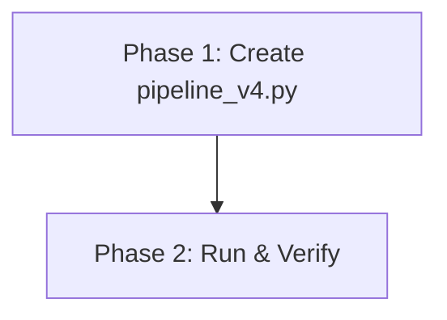
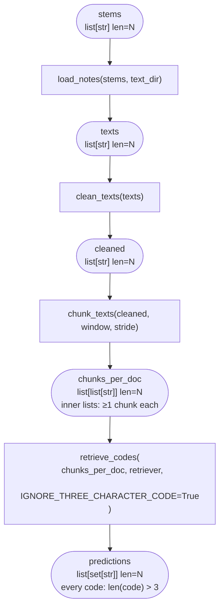
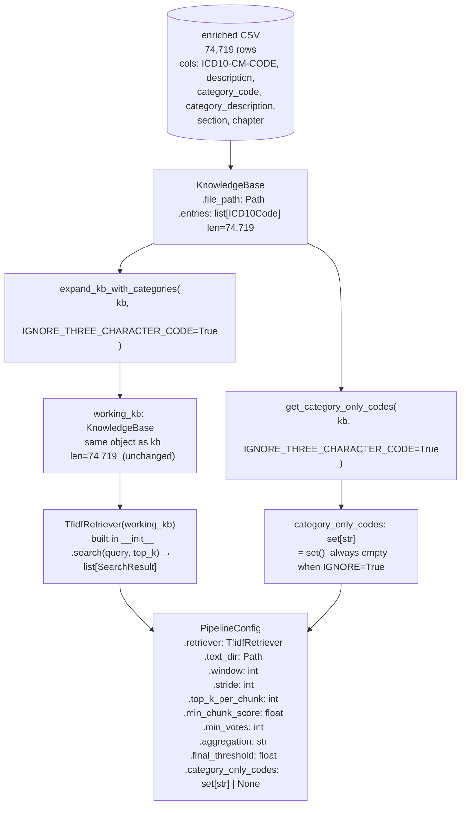
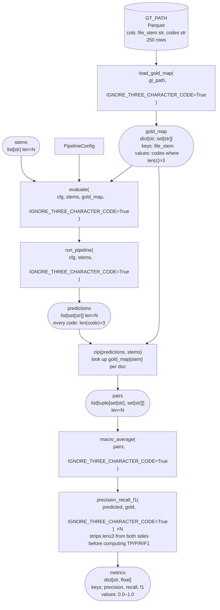
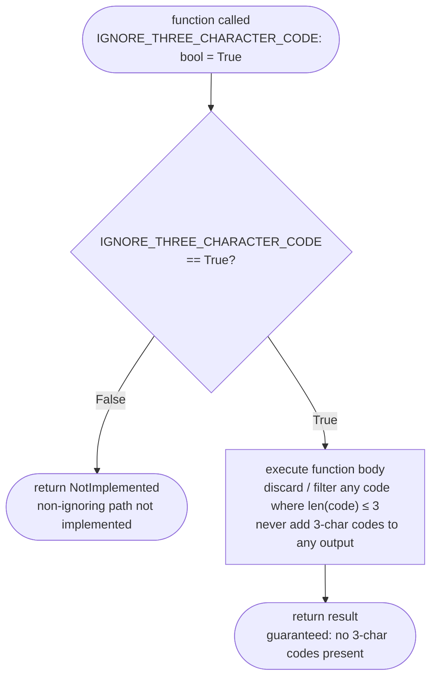

# Multi-Label ICD-10 Retrieval Pipeline v4 — Implementation Plan

> **Status:** DRAFT

## Table of Contents

- [Overview](#overview)
- [Current State Analysis](#current-state-analysis)
- [Desired End State](#desired-end-state)
- [What We're NOT Doing](#what-were-not-doing)
- [File Inventory](#file-inventory)
- [Implementation Approach](#implementation-approach)
- [Dependencies](#dependencies)
- [Phase 1: Create pipeline_v4.py](#phase-1-create-pipeline_v4py)
- [Phase 2: Run Evaluation](#phase-2-run-evaluation)
- [Testing Strategy](#testing-strategy)
- [References](#references)

## Overview

Implement a multi-label ICD-10 retrieval pipeline (`src/pipeline_v4.py`) that processes clinical notes and predicts sets of ICD-10-CM codes. The pipeline uses a sliding-window chunking approach (Option E from v2) to handle long clinical notes.

**Key design principle — `IGNORE_THREE_CHARACTER_CODE` flag:** All functions that touch 3-character codes accept `IGNORE_THREE_CHARACTER_CODE: bool = True` as a keyword-only argument. If the flag is `False`, the function returns `NotImplemented` immediately (the non-ignoring path is not implemented). When `True` (the default), any 3-character codes encountered are silently dropped/discarded throughout. This keeps the pipeline focused on 4–7 character billable codes without dead code paths.

**Key change from v3:** Replaces `sklearn.Pipeline` with plain functions. The v3 plan had a critical bug: sklearn Pipeline requires intermediate steps to have `transform()` and the final step to have `predict()`, but `ChunkedRetrievalPredictor` (intermediate when rollup is enabled) lacked `transform()` and `CategoryRollUpTransformer` (final) lacked `predict()`, crashing 30 of 31 evaluation configs. The v4 design eliminates this entire class of bug by using a simple function chain with a single `run_pipeline()` function — no fit/predict split, no redundant file I/O, no sklearn protocol constraints.

## Current State Analysis

### Key Discoveries

- `src/knowledge_base.py:34-36` — `KnowledgeBase.__init__` reads from `data/processed/icd10cm-codes-enriched-April-1-2026.csv` (74,719 entries). Instance attributes: `file_path` (Path) and `entries` (list[ICD10Code]).
- `src/knowledge_base.py:25-30` — `ICD10Code` dataclass has fields: `code` (str), `description` (str), `description_aliases` (list[str]), `category` (Category|None), `chapter` (Chapter|None).
- **Runtime type mismatch**: `_entries_from_df()` at `knowledge_base.py:43-58` passes raw scalar values from the CSV, not typed objects:
  - `category` field receives a **raw `str`** (e.g., `"A00"`) from the `category_code` CSV column — NOT a `Category` object.
  - `chapter` field receives a **raw `int`** (e.g., `1`) from the `chapter` CSV column — NOT a `Chapter` object or string. Polars infers the CSV column as integer.
  - `description_aliases` field receives a **raw `str`** (a copy of `description`) because the enriched CSV lacks a `description_aliases` column. `_entries_from_df` line 44-47 creates a synthetic column by mirroring `description`.
- `src/knowledge_base.py:80-87` — `KnowledgeBase.load_from_parquet()` uses `cls.__new__(cls)` to bypass `__init__`, then sets `file_path` and `entries`. We use this same pattern for KB expansion.
- `src/retriever.py:40-65` — `TfidfRetriever.__init__(kb)` builds TF-IDF index on `kb.entries` descriptions. Only uses `e.code` and `e.description` from entries. The index is built during `__init__` (not a separate `fit()` call).
- `src/retriever.py:67-87` — `TfidfRetriever.search(query, top_k=5)` returns `list[SearchResult]` where each has `.code` (str), `.score` (float), `.description` (str), `.rank` (int).

### CSV Column Names (Critical)

**Enriched CSV** (`data/processed/icd10cm-codes-enriched-April-1-2026.csv`) — the single source of truth, loaded as `kb.file_path`:
- Columns: `ICD10-CM-CODE`, `description`, `category_code`, `category_description`, `section`, `chapter`
- The `category_code` and `category_description` columns already carry all category information needed for KB expansion and roll-up. No separate raw categories CSV is required.
- `chapter` column contains bare integers (e.g., `1`), not strings.

**Ground Truth Parquet** (`data/test-datasets/codiesp/data-pipeline/processed/gold/codiesp_ground_truth.parquet`):
- Columns: `file_stem`, `codes` (semicolon-separated string of ICD-10 codes, may have duplicates)
- 250 rows (dev split documents)

**Text Files**: 250 `.txt` files in `data/test-datasets/codiesp/gold/final_dataset_v4_to_publish/dev/text_files_en/`

### Existing Pipeline Files

No pipeline files exist yet (`src/pipeline_v4.py`, `src/pipeline_v3.py`, `src/pipeline.py`, etc. are all absent). This is a new file.

## Desired End State

A single new file `src/pipeline_v4.py` that:
- Contains plain-function pipeline steps (load_notes, clean_texts, chunk_texts, retrieve_codes, rollup_categories) — no sklearn base classes
- Contains KB expansion and category-only-code utility functions, each guarded by `IGNORE_THREE_CHARACTER_CODE`
- Contains evaluation helpers (precision/recall/F1, macro average, gold map loading with 3-char code filtering)
- Contains a `build_pipeline()` factory that returns a `PipelineConfig` dataclass
- Contains a `run_pipeline()` function that executes all steps in a single pass (no fit/predict split)
- Contains a `__main__` block that runs a single baseline + parameter sweep (27 configs)
- Runs successfully via `uv run python src/pipeline_v4.py` from project root

**Success Criteria:**
- [ ] `src/pipeline_v4.py` exists and passes `uv run ruff check src/pipeline_v4.py`
- [ ] `src/pipeline_v4.py` passes `uv run ruff format --check src/pipeline_v4.py`
- [ ] `uv run python src/pipeline_v4.py` runs end-to-end without errors, exit code 0
- [ ] Output contains exactly 1 metric row in the "Baseline" section (with `P=`, `R=`, `F1=`)
- [ ] Output contains exactly 27 metric rows in the "Parameter Sweep" section
- [ ] Output contains a `Best:` line with a dict including an `f1` key

## What We're NOT Doing

- NOT modifying `src/knowledge_base.py` or `src/retriever.py`
- NOT adding tests (evaluation is built into the script's `__main__` block)
- NOT implementing Strategy 3 (Dual-Index)
- NOT implementing the soft evaluation variant (deferred to a future iteration)
- NOT modifying any existing data files
- NOT using sklearn (Pipeline, BaseEstimator, TransformerMixin, ClassifierMixin)
- NOT using numpy (was only needed for sklearn's `classes_` attribute)
- NOT handling 3-character codes — all functions that touch them accept `IGNORE_THREE_CHARACTER_CODE: bool = True`; the non-ignoring path returns `NotImplemented` immediately; the ignoring path discards any 3-char codes found

## File Inventory

| File | Action | Phase | Purpose |
|------|--------|-------|---------|
| `src/pipeline_v4.py` | CREATE | 1 | Complete multi-label retrieval pipeline with evaluation |

## Implementation Approach

### Execution Flow



### Architecture / Data Flow

Four diagrams follow. Agents implementing this plan should verify that every
function's actual inputs and outputs match the annotated shapes exactly.

---

#### Diagram 1 — Main Pipeline: Step-by-Step with Types

Every step preserves the outer list length (`N` = number of documents).
Three-character codes are removed at `retrieve_codes`; nothing downstream
should ever see a code where `len(code) <= 3`.



---

#### Diagram 2 — KB Setup → PipelineConfig

`expand_kb_with_categories` and `get_category_only_codes` are no-ops when
`IGNORE_THREE_CHARACTER_CODE=True`. The TF-IDF index is built exactly **once**
per `build_pipeline()` call over the original 74,719-entry KB.



---

#### Diagram 3 — Evaluation Chain with Types

`load_gold_map` strips 3-char codes from the ground truth.
`precision_recall_f1` strips them again from both sides as a safety net.
No 3-char code can reach the arithmetic.



---

#### Diagram 4 — IGNORE_THREE_CHARACTER_CODE Flag Guard Pattern

Every function that can touch a 3-char code follows this exact structure.
Agents must apply it uniformly — no function may skip the early-return guard
or omit the `len(code) > 3` filter in its body.



Functions that carry this guard:
`expand_kb_with_categories` · `get_category_only_codes` · `retrieve_codes` ·
`rollup_categories` · `load_gold_map` · `build_pipeline` · `run_pipeline` ·
`evaluate` · `precision_recall_f1` · `macro_average`

### Decision Log

| Decision | Options Considered | Chosen | Rationale |
|----------|-------------------|--------|-----------|
| Source for category data | Separate raw categories CSV vs enriched CSV columns | Enriched CSV (`kb.file_path`) | The enriched CSV already has `category_code` and `category_description` columns; reading a second CSV is unnecessary |
| How to set `category` field on new ICD10Code entries | Create `Category` object vs pass raw string | Raw string (matching existing runtime behavior) | `_entries_from_df()` stores raw strings in the `category` field despite the type annotation. Consistency avoids bugs in `save()` and other methods. |
| How to set `chapter` field on new ICD10Code entries | Pass `str(row["chapter"])` vs pass `row["chapter"]` directly | Pass directly (int) | Polars infers the CSV `chapter` column as `int`. Existing entries store `int` at runtime. Wrapping in `str()` would create type inconsistency. |
| How to set `description_aliases` on new entries | Pass `list[str]` vs pass raw `str` | Pass raw `str` (matching existing runtime behavior) | `_entries_from_df()` mirrors the `description` column as `description_aliases`, producing a raw `str` at runtime, not `list[str]`. New entries must match to avoid type inconsistency in `save()`. |
| Pipeline framework | sklearn Pipeline vs plain functions | Plain functions | sklearn Pipeline caused a critical architecture bug in v3 (missing `transform()`/`predict()` bridge methods). A simple function chain avoids all sklearn protocol issues, eliminates redundant fit/predict file I/O, and is clearer for this non-ML-training use case. |
| 3-character code handling | Implement full handling vs flag-guard and discard | `IGNORE_THREE_CHARACTER_CODE=True` flag | Avoids complexity of 3-char strategies; the flag makes the unimplemented path explicit (returns `NotImplemented`) while the default path silently drops any 3-char codes encountered. |

## Dependencies

**Execution Order:**
1. Phase 1 — Create the file (no dependencies)
2. Phase 2 — Run and verify (depends on Phase 1)

## Phase 1: Create pipeline_v4.py

### Overview
Create the complete `src/pipeline_v4.py` file containing all pipeline components as plain functions, evaluation helpers, and the main evaluation script.

### Context
Before starting, read these files:
- `src/knowledge_base.py` — KnowledgeBase, ICD10Code, Category, Chapter classes
- `src/retriever.py` — TfidfRetriever, SearchResult classes
- First 3 lines of `data/processed/icd10cm-codes-enriched-April-1-2026.csv` — to confirm columns: `ICD10-CM-CODE`, `description`, `category_code`, `category_description`, `section`, `chapter`

### Dependencies
**Depends on:** None
**Required by:** Phase 2

### Changes Required

#### 1.1: Create `src/pipeline_v4.py`
**File:** `src/pipeline_v4.py`
**Action:** CREATE

**What this does:** Creates the complete multi-label ICD-10 retrieval pipeline with evaluation helpers and a parameter sweep main block. Uses plain functions. All functions that touch 3-character codes are guarded by `IGNORE_THREE_CHARACTER_CODE=True`; if the flag is False they return `NotImplemented` immediately; if True, 3-char codes are discarded.

**Complete file content:**

```python
"""Multi-label ICD-10 retrieval pipeline (4–7 char codes only).

Uses a sliding-window chunking approach (Option E from v2) to handle
long clinical notes. Three-character category codes are discarded
throughout — see IGNORE_THREE_CHARACTER_CODE flag on each function.

Run from project root:
    uv run python src/pipeline_v4.py
"""

from __future__ import annotations

import re
from collections import defaultdict
from dataclasses import dataclass
from pathlib import Path

from types import NotImplementedType

import polars as pl

from knowledge_base import ICD10Code, KnowledgeBase
from retriever import TfidfRetriever

# ===================================================================
# Project paths (relative to project root)
# ===================================================================

PROJECT_ROOT = Path(__file__).parent.parent
KB_PATH = PROJECT_ROOT / "data" / "processed" / "icd10cm-codes-enriched-April-1-2026.csv"
GT_PATH = (
    PROJECT_ROOT
    / "data"
    / "test-datasets"
    / "codiesp"
    / "data-pipeline"
    / "processed"
    / "gold"
    / "codiesp_ground_truth.parquet"
)
TEXT_DIR = (
    PROJECT_ROOT
    / "data"
    / "test-datasets"
    / "codiesp"
    / "gold"
    / "final_dataset_v4_to_publish"
    / "dev"
    / "text_files_en"
)


# ===================================================================
# Step 0: KB expansion — add category-only codes
# ===================================================================


def expand_kb_with_categories(
    kb: KnowledgeBase,
    *,
    IGNORE_THREE_CHARACTER_CODE: bool = True,
) -> KnowledgeBase | NotImplementedType:
    """Add category-level entries to the KnowledgeBase.

    Parameters
    ----------
    kb : KnowledgeBase
        Original KB (74,719 billable code entries).
    IGNORE_THREE_CHARACTER_CODE : bool
        If False, returns NotImplemented immediately (not implemented).
        If True (default), 3-char category codes are discarded and the
        original KB is returned unchanged.

    Returns
    -------
    KnowledgeBase
        Original KB unchanged (3-char codes are discarded when flag is True).
    """
    if not IGNORE_THREE_CHARACTER_CODE:
        return NotImplemented
    # 3-char category codes are discarded; return the original KB as-is
    return kb


def get_category_only_codes(
    kb: KnowledgeBase,
    *,
    IGNORE_THREE_CHARACTER_CODE: bool = True,
) -> set[str] | NotImplementedType:
    """Return 3-char codes that are ICD-10-CM categories but NOT billable.

    Parameters
    ----------
    kb : KnowledgeBase
        Knowledge base (used to identify billable codes).
    IGNORE_THREE_CHARACTER_CODE : bool
        If False, returns NotImplemented immediately (not implemented).
        If True (default), all category-only codes are 3-char and are
        therefore discarded; returns an empty set.

    Returns
    -------
    set[str]
        Empty set (all category-only codes are 3-char, so all are discarded).
    """
    if not IGNORE_THREE_CHARACTER_CODE:
        return NotImplemented
    # All category-only codes are 3-char; discard them all
    return set()


# ===================================================================
# Pipeline step 1: Load text from disk
# ===================================================================


def load_notes(stems: list[str], text_dir: Path = TEXT_DIR) -> list[str]:
    """Load clinical note text files from disk.

    Parameters
    ----------
    stems : list[str]
        File stems (e.g., 'S0004-06142005000900016-1').
    text_dir : Path
        Directory containing <stem>.txt files.

    Returns
    -------
    list[str]
        UTF-8 text contents, one per stem.
    """
    return [
        (text_dir / f"{stem}.txt").read_text(encoding="utf-8", errors="replace")
        for stem in stems
    ]


# ===================================================================
# Pipeline step 2: Normalize text
# ===================================================================


def clean_texts(texts: list[str], *, lowercase: bool = True) -> list[str]:
    """Collapse whitespace and optionally lowercase."""
    result: list[str] = []
    for text in texts:
        text = re.sub(r"\s+", " ", text).strip()
        if lowercase:
            text = text.lower()
        result.append(text)
    return result


# ===================================================================
# Pipeline step 3: Sliding-window chunker
# ===================================================================


def chunk_texts(
    texts: list[str],
    *,
    window: int = 3,
    stride: int = 2,
    min_words: int = 3,
    include_full_text: bool = True,
) -> list[list[str]]:
    """Split each text into overlapping sentence-window chunks.

    Parameters
    ----------
    texts : list[str]
        One text per document.
    window : int
        Number of sentences per chunk.
    stride : int
        Step between chunk starts.  stride < window means overlap.
    min_words : int
        Minimum tokens for a sentence to be included.
    include_full_text : bool
        Append the full document as an extra chunk (preserves global context).

    Returns
    -------
    list[list[str]]
        One list-of-chunks per document.
    """
    result: list[list[str]] = []
    for text in texts:
        sentences = [
            s.strip()
            for s in re.split(r"(?<=[.!?])\s+", text.strip())
            if len(s.split()) >= min_words
        ]
        chunks: list[str] = []
        for i in range(0, max(1, len(sentences) - window + 1), stride):
            chunk = " ".join(sentences[i : i + window])
            if chunk:
                chunks.append(chunk)
        if include_full_text:
            chunks.append(text)
        result.append(chunks)
    return result


# ===================================================================
# Pipeline step 4: Chunked retrieval predictor
# ===================================================================


def retrieve_codes(
    chunks_per_doc: list[list[str]],
    retriever: TfidfRetriever,
    *,
    top_k_per_chunk: int = 10,
    min_chunk_score: float = 0.04,
    min_votes: int = 1,
    aggregation: str = "max",
    final_threshold: float = 0.04,
    IGNORE_THREE_CHARACTER_CODE: bool = True,
) -> list[set[str]] | NotImplementedType:
    """Multi-label prediction: TF-IDF search per chunk, aggregate, threshold.

    For each document's chunks, retrieves top_k codes per chunk,
    aggregates scores across chunks, filters by votes + threshold.

    Parameters
    ----------
    chunks_per_doc : list[list[str]]
        One list-of-chunks per document.
    retriever : TfidfRetriever
        Pre-built TF-IDF retriever (built once over the KB).
    top_k_per_chunk : int
        How many candidate codes to retrieve per chunk.
    min_chunk_score : float
        Per-chunk cosine score floor.
    min_votes : int
        A code must appear in at least this many chunks to survive.
    aggregation : str
        "max", "mean", or "sum".
    final_threshold : float
        Aggregated score must exceed this to appear in the prediction.
    IGNORE_THREE_CHARACTER_CODE : bool
        If False, returns NotImplemented immediately (not implemented).
        If True (default), any 3-char codes in retrieval results are
        discarded before returning.

    Returns
    -------
    list[set[str]]
        One set of predicted ICD-10 codes per document (4–7 char only).
    """
    if not IGNORE_THREE_CHARACTER_CODE:
        return NotImplemented
    predictions: list[set[str]] = []
    for chunks in chunks_per_doc:
        code_scores: dict[str, list[float]] = defaultdict(list)
        for chunk in chunks:
            hits = retriever.search(chunk, top_k=top_k_per_chunk)
            for h in hits:
                if h.score >= min_chunk_score:
                    code_scores[h.code].append(h.score)

        filtered = {
            code: scores
            for code, scores in code_scores.items()
            if len(scores) >= min_votes
        }

        aggregated: dict[str, float] = {}
        for code, scores in filtered.items():
            if aggregation == "max":
                aggregated[code] = max(scores)
            elif aggregation == "mean":
                aggregated[code] = sum(scores) / len(scores)
            else:  # "sum"
                aggregated[code] = sum(scores)

        predictions.append(
            {
                code
                for code, score in aggregated.items()
                if score >= final_threshold and len(code) > 3  # discard 3-char codes
            }
        )
    return predictions


# ===================================================================
# Pipeline step 5: Category roll-up (Strategy 2b)
# ===================================================================


def rollup_categories(
    predictions: list[set[str]],
    category_only_codes: set[str],
    *,
    IGNORE_THREE_CHARACTER_CODE: bool = True,
) -> list[set[str]] | NotImplementedType:
    """Post-prediction: drop any 3-char codes from predictions.

    With IGNORE_THREE_CHARACTER_CODE=True (default), 3-char codes are
    discarded from the prediction sets and no new 3-char category codes
    are added. The category_only_codes argument is accepted for API
    compatibility but is not used when the flag is True.

    Parameters
    ----------
    predictions : list[set[str]]
        One set of predicted codes per document.
    category_only_codes : set[str]
        Unused when IGNORE_THREE_CHARACTER_CODE=True.
    IGNORE_THREE_CHARACTER_CODE : bool
        If False, returns NotImplemented immediately (not implemented).
        If True (default), drops any 3-char codes from predictions
        and does not add new category codes.

    Returns
    -------
    list[set[str]]
        Predictions with all 3-char codes removed.
    """
    if not IGNORE_THREE_CHARACTER_CODE:
        return NotImplemented
    # Drop any 3-char codes already in the prediction sets; don't add new ones
    return [{code for code in pred_set if len(code) > 3} for pred_set in predictions]


# ===================================================================
# Evaluation helpers
# ===================================================================


def precision_recall_f1(
    predicted: set[str],
    gold: set[str],
    *,
    IGNORE_THREE_CHARACTER_CODE: bool = True,
) -> dict[str, float] | NotImplementedType:
    """Per-document precision, recall, F1.

    Parameters
    ----------
    predicted : set[str]
        Predicted ICD-10 codes for one document.
    gold : set[str]
        Ground-truth ICD-10 codes for one document.
    IGNORE_THREE_CHARACTER_CODE : bool
        If False, returns NotImplemented immediately (not implemented).
        If True (default), any 3-char codes in predicted or gold are
        discarded before computing metrics so they cannot inflate or
        deflate performance.
    """
    if not IGNORE_THREE_CHARACTER_CODE:
        return NotImplemented
    # Discard 3-char codes from both sides before scoring
    predicted = {c for c in predicted if len(c) > 3}
    gold = {c for c in gold if len(c) > 3}
    if not predicted and not gold:
        return {"precision": 1.0, "recall": 1.0, "f1": 1.0}
    tp = len(predicted & gold)
    precision = tp / len(predicted) if predicted else 0.0
    recall = tp / len(gold) if gold else 0.0
    f1 = (
        (2 * precision * recall / (precision + recall))
        if (precision + recall)
        else 0.0
    )
    return {"precision": precision, "recall": recall, "f1": f1}


def macro_average(
    pairs: list[tuple[set[str], set[str]]],
    *,
    IGNORE_THREE_CHARACTER_CODE: bool = True,
) -> dict[str, float] | NotImplementedType:
    """Macro-average P/R/F1 over (predicted, gold) pairs.

    Parameters
    ----------
    pairs : list[tuple[set[str], set[str]]]
        List of (predicted, gold) set pairs, one per document.
    IGNORE_THREE_CHARACTER_CODE : bool
        If False, returns NotImplemented immediately (not implemented).
        If True (default), passed through to precision_recall_f1 so
        3-char codes are stripped from every pair before scoring.

    Returns
    -------
    dict[str, float]
        Macro-averaged metrics with keys: ``precision``, ``recall``, ``f1``.
        All values in [0.0, 1.0], rounded to 4 decimal places.
    """
    if not IGNORE_THREE_CHARACTER_CODE:
        return NotImplemented
    agg: dict[str, float] = {"precision": 0.0, "recall": 0.0, "f1": 0.0}
    for pred, gold in pairs:
        m = precision_recall_f1(
            pred, gold, IGNORE_THREE_CHARACTER_CODE=IGNORE_THREE_CHARACTER_CODE
        )
        for k in agg:
            agg[k] += m[k]
    n = len(pairs)
    return {k: round(v / n, 4) for k, v in agg.items()}


def load_gold_map(
    gt_path: Path = GT_PATH,
    *,
    IGNORE_THREE_CHARACTER_CODE: bool = True,
) -> dict[str, set[str]] | NotImplementedType:
    """Load ground truth -> {file_stem: set_of_unique_codes}.

    Parameters
    ----------
    gt_path : Path
        Path to the ground truth parquet file.
    IGNORE_THREE_CHARACTER_CODE : bool
        If False, returns NotImplemented immediately (not implemented).
        If True (default), any 3-char codes in the ground truth are
        discarded before returning.

    Returns
    -------
    dict[str, set[str]]
        Mapping from file stem to set of codes (4–7 char only).
    """
    if not IGNORE_THREE_CHARACTER_CODE:
        return NotImplemented
    df = pl.read_parquet(gt_path)
    return {
        str(row["file_stem"]): {
            c for c in str(row["codes"]).split(";") if len(c) > 3  # discard 3-char codes
        }
        for row in df.iter_rows(named=True)
    }


# ===================================================================
# Pipeline config and runner
# ===================================================================


@dataclass
class PipelineConfig:
    """All tunable parameters for the v4 pipeline."""

    retriever: TfidfRetriever
    text_dir: Path = TEXT_DIR
    # Chunker params
    window: int = 3
    stride: int = 2
    # Retrieval params
    top_k_per_chunk: int = 10
    min_chunk_score: float = 0.04
    min_votes: int = 1
    aggregation: str = "max"
    final_threshold: float = 0.04
    # Category handling (unused when IGNORE_THREE_CHARACTER_CODE=True)
    category_only_codes: set[str] | None = None


def run_pipeline(
    cfg: PipelineConfig,
    stems: list[str],
    *,
    IGNORE_THREE_CHARACTER_CODE: bool = True,
) -> list[set[str]] | NotImplementedType:
    """Execute the full pipeline in a single pass.

    Steps:
        1. Load clinical note texts from disk
        2. Clean/normalize texts
        3. Chunk texts into sliding windows
        4. Retrieve candidate ICD-10 codes per chunk (3-char dropped)
        5. Optionally roll up to category codes (no-op with flag=True)

    Parameters
    ----------
    cfg : PipelineConfig
        Pipeline configuration (retriever, thresholds, etc.).
    stems : list[str]
        File stems identifying the clinical notes.
    IGNORE_THREE_CHARACTER_CODE : bool
        If False, returns NotImplemented immediately (not implemented).
        If True (default), 3-char codes are discarded at each step.

    Returns
    -------
    list[set[str]]
        One set of predicted ICD-10 codes per document (4–7 char only).
    """
    if not IGNORE_THREE_CHARACTER_CODE:
        return NotImplemented
    texts = load_notes(stems, cfg.text_dir)
    cleaned = clean_texts(texts)
    chunks = chunk_texts(cleaned, window=cfg.window, stride=cfg.stride)
    predictions = retrieve_codes(
        chunks,
        cfg.retriever,
        top_k_per_chunk=cfg.top_k_per_chunk,
        min_chunk_score=cfg.min_chunk_score,
        min_votes=cfg.min_votes,
        aggregation=cfg.aggregation,
        final_threshold=cfg.final_threshold,
        IGNORE_THREE_CHARACTER_CODE=IGNORE_THREE_CHARACTER_CODE,
    )
    if cfg.category_only_codes is not None:
        predictions = rollup_categories(
            predictions,
            cfg.category_only_codes,
            IGNORE_THREE_CHARACTER_CODE=IGNORE_THREE_CHARACTER_CODE,
        )
    return predictions


def build_pipeline(
    kb: KnowledgeBase,
    text_dir: Path = TEXT_DIR,
    *,
    window: int = 3,
    stride: int = 2,
    top_k_per_chunk: int = 10,
    min_chunk_score: float = 0.04,
    min_votes: int = 1,
    aggregation: str = "max",
    final_threshold: float = 0.04,
    expand_kb: bool = False,
    enable_rollup: bool = False,
    IGNORE_THREE_CHARACTER_CODE: bool = True,
) -> PipelineConfig | NotImplementedType:
    """Build the full end-to-end v4 pipeline config.

    Input:  list[str]       file stems (passed to run_pipeline)
    Output: list[set[str]]  predicted ICD-10 code sets (4–7 char only)

    Parameters
    ----------
    kb : KnowledgeBase
        Original KB.
    expand_kb : bool
        If True, calls expand_kb_with_categories (no-op when flag=True).
    enable_rollup : bool
        If True, applies post-prediction rollup (no-op when flag=True).
    IGNORE_THREE_CHARACTER_CODE : bool
        If False, returns NotImplemented immediately (not implemented).
        If True (default), passed through to all sub-functions; 3-char
        codes are discarded at every step.
    """
    if not IGNORE_THREE_CHARACTER_CODE:
        return NotImplemented
    working_kb = kb
    if expand_kb:
        working_kb = expand_kb_with_categories(
            kb, IGNORE_THREE_CHARACTER_CODE=IGNORE_THREE_CHARACTER_CODE
        )

    # Build TF-IDF index once (TfidfRetriever builds in __init__)
    retriever = TfidfRetriever(working_kb)

    cat_only = (
        get_category_only_codes(
            kb, IGNORE_THREE_CHARACTER_CODE=IGNORE_THREE_CHARACTER_CODE
        )
        if enable_rollup
        else None
    )

    return PipelineConfig(
        retriever=retriever,
        text_dir=text_dir,
        window=window,
        stride=stride,
        top_k_per_chunk=top_k_per_chunk,
        min_chunk_score=min_chunk_score,
        min_votes=min_votes,
        aggregation=aggregation,
        final_threshold=final_threshold,
        category_only_codes=cat_only,
    )


# ===================================================================
# End-to-end evaluation
# ===================================================================


def evaluate(
    cfg: PipelineConfig,
    stems: list[str],
    gold_map: dict[str, set[str]],
    label: str = "",
    *,
    IGNORE_THREE_CHARACTER_CODE: bool = True,
) -> dict[str, float] | NotImplementedType:
    """Run pipeline over ``stems`` and compute macro-averaged P/R/F1.

    Parameters
    ----------
    cfg : PipelineConfig
        Fully constructed pipeline configuration (from ``build_pipeline``).
    stems : list[str]
        File stems to evaluate; must all be keys in ``gold_map``.
    gold_map : dict[str, set[str]]
        Mapping from file stem to ground-truth code set (4–7 char codes only,
        as returned by ``load_gold_map``).
    label : str
        Optional display label printed next to the metrics.  Pass ``""``
        to suppress output.
    IGNORE_THREE_CHARACTER_CODE : bool
        If False, returns NotImplemented immediately (not implemented).
        If True (default), passed through to ``run_pipeline`` and
        ``macro_average``; 3-char codes are stripped at every layer.

    Returns
    -------
    dict[str, float]
        Macro-averaged metrics with keys: ``precision``, ``recall``, ``f1``.
        All values in [0.0, 1.0], rounded to 4 decimal places.
    """
    if not IGNORE_THREE_CHARACTER_CODE:
        return NotImplemented
    predictions = run_pipeline(
        cfg, stems, IGNORE_THREE_CHARACTER_CODE=IGNORE_THREE_CHARACTER_CODE
    )
    pairs = [(pred, gold_map[stem]) for pred, stem in zip(predictions, stems)]
    metrics = macro_average(
        pairs, IGNORE_THREE_CHARACTER_CODE=IGNORE_THREE_CHARACTER_CODE
    )
    if label:
        print(
            f"{label:<40}  "
            f"P={metrics['precision']:.4f}  "
            f"R={metrics['recall']:.4f}  "
            f"F1={metrics['f1']:.4f}"
        )
    return metrics


# ===================================================================
# Main: baseline + parameter sweep
# ===================================================================

if __name__ == "__main__":
    import itertools

    kb_original = KnowledgeBase(KB_PATH)
    gold_map = load_gold_map(IGNORE_THREE_CHARACTER_CODE=True)
    stems = sorted(gold_map.keys())

    print("=" * 72)
    print("Multi-Label ICD-10 Retrieval - v4 Evaluation")
    print("=" * 72)
    print(f"Documents: {len(stems)}")
    print(f"KB size: {len(kb_original.entries):,}")
    print()

    # --- Baseline ---
    print("--- Baseline ---")
    cfg_baseline = build_pipeline(kb_original, IGNORE_THREE_CHARACTER_CODE=True)
    evaluate(
        cfg_baseline,
        stems,
        gold_map,
        label="Baseline",
        IGNORE_THREE_CHARACTER_CODE=True,
    )

    # --- Parameter sweep ---
    print()
    print("--- Parameter Sweep ---")

    best_f1: float = 0.0
    best_cfg: dict = {}
    for window, top_k, threshold in itertools.product(
        [2, 3, 5],
        [5, 10, 20],
        [0.03, 0.05, 0.08],
    ):
        cfg = build_pipeline(
            kb_original,
            window=window,
            top_k_per_chunk=top_k,
            final_threshold=threshold,
            IGNORE_THREE_CHARACTER_CODE=True,
        )
        m = evaluate(
            cfg,
            stems,
            gold_map,
            label=f"  w={window} k={top_k} t={threshold:.2f}",
            IGNORE_THREE_CHARACTER_CODE=True,
        )
        if m["f1"] > best_f1:
            best_f1 = m["f1"]
            best_cfg = {
                "window": window,
                "top_k": top_k,
                "threshold": threshold,
                **m,
            }

    print()
    print(f"Best: {best_cfg}")
```

### Success Criteria

#### Automated Verification:
- [ ] File exists: `test -f src/pipeline_v4.py`
- [ ] Linting passes: `uv run ruff check src/pipeline_v4.py`
- [ ] Formatting passes: `uv run ruff format --check src/pipeline_v4.py`

---

## Phase 2: Run Evaluation

### Overview
Run the pipeline script and verify it produces metrics without errors.

### Context
Before starting, read:
- `src/pipeline_v4.py` — the file created in Phase 1

### Dependencies
**Depends on:** Phase 1
**Required by:** None

### Changes Required

No file changes. Run the script:

```bash
cd C:/Users/sqr99/NewPythonProjects/Interviews/anthuria-project
uv run python src/pipeline_v4.py
```

**Expected runtime:** 5–20 minutes depending on hardware. The script builds the TF-IDF index once for the baseline and once per sweep config (28 total). Progress is visible as metric rows print one at a time.

**Expected output structure:**
1. Header: `Multi-Label ICD-10 Retrieval - v4 Evaluation`
2. Baseline section: `--- Baseline ---` followed by exactly 1 metric row containing `P=`, `R=`, `F1=`
3. Sweep section: `--- Parameter Sweep ---` followed by exactly 27 metric rows
4. Final line: `Best: {...}` with a dict containing keys `window`, `top_k`, `threshold`, `precision`, `recall`, `f1`

**If the script fails**, the most likely causes are:
1. **Import error for `knowledge_base` or `retriever`**: The `uv run` command should add `src/` to `sys.path` via `pyproject.toml` `pythonpath = ["src"]`. If not, add these two lines at the top of `src/pipeline_v4.py` (after `from pathlib import Path`, before `from knowledge_base import ...`):
    ```python
    import sys
    sys.path.insert(0, str(Path(__file__).parent))
    ```
    Then re-run.
2. **Column name mismatch**: Verify the enriched CSV has `category_code` and `category_description` columns (confirmed in Current State Analysis).
3. **Missing text files**: Verify `data/test-datasets/codiesp/gold/final_dataset_v4_to_publish/dev/text_files_en/` contains `.txt` files.

### Success Criteria

#### Automated Verification:
- [ ] Script runs without errors: `uv run python src/pipeline_v4.py` exits with code 0
- [ ] Output contains "Best:" line with a configuration dict (verify with: `uv run python src/pipeline_v4.py 2>&1 | grep "^Best:"`)

#### Manual Verification:
- [ ] Baseline section shows exactly 1 metric row
- [ ] Parameter sweep shows exactly 27 metric rows
- [ ] Best configuration's F1 is > 0.0 (indicating the pipeline produces meaningful predictions)

---

## Testing Strategy

### Unit Tests:
Not in scope for this plan. The `__main__` block serves as an integration test.

### Integration Tests:
The `__main__` block of `pipeline_v4.py` runs the full pipeline over 250 CodiEsp dev documents and reports macro-averaged P/R/F1. This serves as the end-to-end verification.

### Manual Testing Steps:
1. Run `uv run python src/pipeline_v4.py` from project root
2. Verify the baseline section shows exactly 1 row of metrics
3. Verify the parameter sweep section shows exactly 27 rows of metrics
4. Verify "Best:" line is printed with the winning configuration
5. Verify F1 > 0.0 for at least the best configuration

## References

- Design document: `plan/thoughts/multi-label-icd10-retrieval-v3.md`
- v3 plan (superseded): `plan/future-plans/2026-02-26-multi-label-icd10-pipeline-v3.md`
- v3 review: `plan/future-plans/2026-02-26-multi-label-icd10-pipeline-v3.REVIEW.md`
- Knowledge base: `src/knowledge_base.py`
- Retriever: `src/retriever.py`
- Enriched CSV (category data source): `data/processed/icd10cm-codes-enriched-April-1-2026.csv`
- Ground truth: `data/test-datasets/codiesp/data-pipeline/processed/gold/codiesp_ground_truth.parquet`
- Text files: `data/test-datasets/codiesp/gold/final_dataset_v4_to_publish/dev/text_files_en/`
