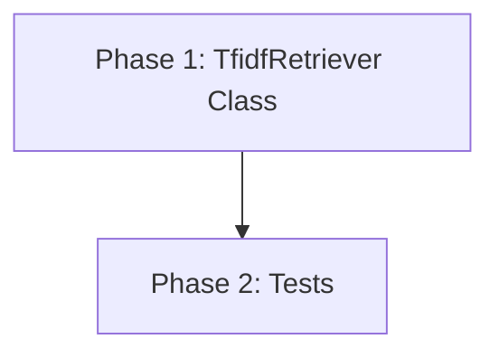

# TF-IDF Search for KnowledgeBase Implementation Plan

> **Status:** DRAFT

## Table of Contents

- [Overview](#overview)
- [Current State Analysis](#current-state-analysis)
- [Desired End State](#desired-end-state)
- [What We're NOT Doing](#what-were-not-doing)
- [File Inventory](#file-inventory)
- [Implementation Approach](#implementation-approach)
- [Dependencies](#dependencies)
- [Phase 1: TfidfRetriever Class](#phase-1-tfidfretriever-class)
- [Phase 2: Tests](#phase-2-tests)
- [Testing Strategy](#testing-strategy)
- [References](#references)

## Overview

Add TF-IDF cosine-similarity search to the ICD-10 KnowledgeBase so nurses can look up
diagnosis codes by natural-language condition descriptions. The retriever builds a TF-IDF
matrix from the `description` field of every `ICD10Code` entry and provides two search
methods:

1. **`search(query, top_k)`** — returns the top-k matching codes ranked by cosine score.
2. **`search_with_siblings(query, top_k)`** — same as `search`, but each result also
   includes all sibling codes that share the same 3-character category prefix, so the
   nurse can confirm the correct specificity level.

## Current State Analysis

### Key Discoveries:
- `src/retriever.py` is an empty file ready for implementation (`src/retriever.py:1`)
- `KnowledgeBase.entries` is a `list[ICD10Code]` with 74,719 items (`src/knowledge_base.py:36`)
- Each `ICD10Code` has `.code` (str) and `.description` (str) (`src/knowledge_base.py:25-30`)
- The category prefix is `code[:3]` per the enrichment pipeline (`CLAUDE.md` architecture section)
- `scikit-learn>=1.8.0` is already a project dependency (`pyproject.toml:18`)
- The TF-IDF demo in `tfidf-demo/step06_cosine_search.py` uses `TfidfVectorizer(ngram_range=(1,2), stop_words="english")` + `linear_kernel` — this is the pattern to replicate
- `tests/data/test_v1.json` has 20 description→expected_code pairs for validation

## Desired End State

A `TfidfRetriever` class in `src/retriever.py` that:
- Accepts a `KnowledgeBase` and builds a TF-IDF matrix at construction time
- Exposes `search(query, top_k=5)` returning a list of `SearchResult` dataclasses
- Exposes `search_with_siblings(query, top_k=5)` returning results enriched with sibling codes
- Is covered by unit tests and validated against the test_v1.json fixture

**Success Criteria:**
- [x] `from retriever import TfidfRetriever` works
- [x] `TfidfRetriever(kb).search("cholera")` returns results with scores
- [x] `TfidfRetriever(kb).search_with_siblings("cholera")` includes sibling codes
- [x] All tests pass: `uv run pytest tests/test_retriever.py`
- [x] Linting passes: `uv run ruff check src/retriever.py tests/test_retriever.py`
- [x] Type checking passes: `uv run ty check src/retriever.py`

**How to Verify:**
```bash
uv run pytest tests/test_retriever.py -v
uv run ruff check src/retriever.py tests/test_retriever.py
uv run ty check src/retriever.py
```

## What We're NOT Doing

- No changes to `KnowledgeBase` or any existing code
- No CLI or API endpoint (search is a library function only)
- No embedding-based or LLM-based search (TF-IDF only)
- No persistence/caching of the TF-IDF matrix to disk
- No changes to `src/vectorizer.py` (reserved for future use)

## File Inventory

| File | Action | Phase | Purpose |
|------|--------|-------|---------|
| `src/retriever.py` | REPLACE_ENTIRE | 1 | TfidfRetriever class with search methods |
| `tests/test_retriever.py` | CREATE | 2 | Unit tests for TfidfRetriever |

## Implementation Approach

### Execution Flow



### Architecture / Data Flow

```mermaid
flowchart LR
    KB["KnowledgeBase\n(74,719 ICD10Code entries)"]
    TR["TfidfRetriever.__init__"]
    VM["TF-IDF Matrix\n(scipy sparse)"]
    Q["Nurse query string"]
    S["search()"]
    SW["search_with_siblings()"]
    R["list[SearchResult]"]
    RS["list[SearchResultWithSiblings]"]

    KB -->|entries| TR
    TR -->|fit_transform descriptions| VM
    Q --> S
    S -->|transform + linear_kernel| R
    Q --> SW
    SW -->|search + group by code[:3]| RS
```

### Decision Log

| Decision | Options Considered | Chosen | Rationale |
|----------|-------------------|--------|-----------|
| Vectorizer params | (1,1) unigrams vs (1,2) bigrams | (1,2) bigrams | Matches demo; medical terms benefit from bigram phrases like "kidney disease" |
| Similarity function | cosine_similarity vs linear_kernel | linear_kernel | Equivalent for L2-normed TF-IDF vectors; slightly faster (no sqrt) |
| Return type | dict vs dataclass | dataclass | Type-safe, consistent with ICD10Code pattern in codebase |
| Sibling lookup | Precompute dict vs filter on the fly | Precompute dict at init | O(1) lookup per result vs O(n) scan; 74K entries makes this worthwhile |
| Stop words | None vs "english" | "english" | Removes noise words; matches demo pattern |

## Dependencies

**Execution Order:**
1. Phase 1 (no dependencies)
2. Phase 2 (depends on Phase 1)

## Phase 1: TfidfRetriever Class

### Overview
Create the `TfidfRetriever` class with two dataclass result types and two search methods.

### Context
Before starting, read these files:
- `src/knowledge_base.py` — ICD10Code dataclass and KnowledgeBase class
- `tfidf-demo/step06_cosine_search.py` — TF-IDF search pattern to replicate

### Dependencies
**Depends on:** None
**Required by:** Phase 2

### Changes Required

#### 1.1: Implement TfidfRetriever
**File:** `src/retriever.py`
**Action:** REPLACE_ENTIRE

**What this does:** Creates the TfidfRetriever class with SearchResult/SearchResultWithSiblings dataclasses and two search methods.

**After** (complete file):
```python
"""TF-IDF cosine-similarity retriever for ICD-10-CM codes."""

from collections import defaultdict
from dataclasses import dataclass, field

import numpy as np
from sklearn.feature_extraction.text import TfidfVectorizer
from sklearn.metrics.pairwise import linear_kernel

from knowledge_base import KnowledgeBase


@dataclass
class SearchResult:
    """A single search hit."""

    rank: int
    code: str
    description: str
    score: float


@dataclass
class SearchResultWithSiblings:
    """A search hit enriched with sibling codes from the same category."""

    rank: int
    code: str
    description: str
    score: float
    category_code: str
    siblings: list[dict[str, str]] = field(default_factory=list)


class TfidfRetriever:
    """Build a TF-IDF index over KnowledgeBase descriptions and search by cosine similarity."""

    def __init__(self, kb: KnowledgeBase) -> None:
        self._kb = kb
        self._codes: list[str] = [e.code for e in kb.entries]
        self._descriptions: list[str] = [e.description for e in kb.entries]

        # Pre-compute category → sibling map for search_with_siblings
        self._category_siblings: dict[str, list[dict[str, str]]] = defaultdict(list)
        for entry in kb.entries:
            cat = entry.code[:3]
            self._category_siblings[cat].append(
                {"code": entry.code, "description": entry.description}
            )

        # Fit TF-IDF vectorizer on corpus
        self._vectorizer = TfidfVectorizer(
            ngram_range=(1, 2), stop_words="english"
        )
        self._corpus_matrix = self._vectorizer.fit_transform(self._descriptions)

    def search(self, query: str, top_k: int = 5) -> list[SearchResult]:
        """Return the *top_k* codes most similar to *query* by cosine score.

        Results are ordered by descending score. Entries with zero similarity
        are excluded, so the returned list may be shorter than *top_k*.
        """
        if top_k <= 0:
            return []
        query_vec = self._vectorizer.transform([query])
        scores: np.ndarray = linear_kernel(query_vec, self._corpus_matrix).flatten()
        top_indices: np.ndarray = scores.argsort()[-top_k:][::-1]
        return [
            SearchResult(
                rank=rank + 1,
                code=self._codes[idx],
                description=self._descriptions[idx],
                score=round(float(scores[idx]), 4),
            )
            for rank, idx in enumerate(top_indices)
            if scores[idx] > 0
        ]

    def search_with_siblings(
        self, query: str, top_k: int = 5
    ) -> list[SearchResultWithSiblings]:
        """Like :meth:`search`, but each result includes sibling codes.

        Siblings are all codes sharing the same 3-character category prefix,
        so the nurse can confirm the correct specificity level.
        """
        base_results = self.search(query, top_k)
        return [
            SearchResultWithSiblings(
                rank=r.rank,
                code=r.code,
                description=r.description,
                score=r.score,
                category_code=r.code[:3],
                siblings=self._category_siblings[r.code[:3]],
            )
            for r in base_results
        ]
```

**Rationale:** Follows the exact same TF-IDF + linear_kernel pattern from the demo.
The class precomputes a category→siblings dict at init for O(1) lookups. Two separate
methods keep the simple case simple while providing the enriched view when needed.

### Success Criteria

#### Automated Verification:
- [x] File exists and is importable: `PYTHONPATH=src uv run python -c "from retriever import TfidfRetriever; print('OK')"`
- [x] Linting passes: `uv run ruff check src/retriever.py`
- [x] Formatting passes: `uv run ruff format --check src/retriever.py`

---

## Phase 2: Tests

### Overview
Create unit tests for TfidfRetriever covering both search methods, edge cases, and
validation against the test_v1.json fixture.

### Context
Before starting, read these files:
- `src/retriever.py` — the class under test (written in Phase 1)
- `tests/test_knowledge_base.py` — existing test patterns (fixtures, naming)
- `tests/data/test_v1.json` — test cases with description→expected_code pairs
- `src/knowledge_base.py` — KnowledgeBase constructor signature

### Dependencies
**Depends on:** Phase 1
**Required by:** None

### Changes Required

#### 2.1: Create test_retriever.py
**File:** `tests/test_retriever.py`
**Action:** CREATE

**What this does:** Provides unit tests for both search methods using a small in-memory
KnowledgeBase fixture plus integration tests against test_v1.json.

**After** (complete file):
```python
"""Tests for TfidfRetriever search methods."""

import json
from pathlib import Path

import polars as pl
import pytest

from knowledge_base import KnowledgeBase
from retriever import SearchResult, SearchResultWithSiblings, TfidfRetriever

# ---------------------------------------------------------------------------
# Fixtures
# ---------------------------------------------------------------------------

SAMPLE_ROWS = [
    ("A000", "Cholera due to Vibrio cholerae 01, biovar cholerae", "A00", 1),
    ("A001", "Cholera due to Vibrio cholerae 01, biovar eltor", "A00", 1),
    ("A009", "Cholera, unspecified", "A00", 1),
    ("A0100", "Typhoid fever, unspecified", "A01", 1),
    ("B0000", "Eczema herpeticum", "B00", 1),
    ("E1110", "Type 2 diabetes mellitus with ketoacidosis without coma", "E11", 4),
    ("E1165", "Type 2 diabetes mellitus with hyperglycemia", "E11", 4),
    ("I2510", "Atherosclerotic heart disease of native coronary artery without angina pectoris", "I25", 9),
    ("J449", "Chronic obstructive pulmonary disease, unspecified", "J44", 10),
]


@pytest.fixture()
def sample_csv(tmp_path: Path) -> Path:
    """Write a minimal enriched CSV that KnowledgeBase can parse."""
    csv_path = tmp_path / "sample.csv"
    pl.DataFrame(
        {
            "ICD10-CM-CODE": [r[0] for r in SAMPLE_ROWS],
            "description": [r[1] for r in SAMPLE_ROWS],
            "category_code": [r[2] for r in SAMPLE_ROWS],
            "chapter": [r[3] for r in SAMPLE_ROWS],
        }
    ).write_csv(csv_path)
    return csv_path


@pytest.fixture()
def kb(sample_csv: Path) -> KnowledgeBase:
    return KnowledgeBase(sample_csv)


@pytest.fixture()
def retriever(kb: KnowledgeBase) -> TfidfRetriever:
    return TfidfRetriever(kb)


# ---------------------------------------------------------------------------
# search() tests
# ---------------------------------------------------------------------------


class TestSearch:
    def test_returns_list_of_search_result(self, retriever: TfidfRetriever) -> None:
        results = retriever.search("cholera")
        assert isinstance(results, list)
        assert all(isinstance(r, SearchResult) for r in results)

    def test_top_result_is_most_relevant(self, retriever: TfidfRetriever) -> None:
        results = retriever.search("cholera")
        assert len(results) > 0
        assert results[0].rank == 1
        # All cholera codes should be in the top results
        result_codes = {r.code for r in results}
        assert "A000" in result_codes or "A001" in result_codes or "A009" in result_codes

    def test_scores_are_descending(self, retriever: TfidfRetriever) -> None:
        results = retriever.search("cholera")
        scores = [r.score for r in results]
        assert scores == sorted(scores, reverse=True)

    def test_ranks_are_sequential(self, retriever: TfidfRetriever) -> None:
        results = retriever.search("cholera")
        ranks = [r.rank for r in results]
        assert ranks == list(range(1, len(ranks) + 1))

    def test_zero_score_results_excluded(self, retriever: TfidfRetriever) -> None:
        results = retriever.search("cholera")
        assert all(r.score > 0 for r in results)

    def test_top_k_limits_results(self, retriever: TfidfRetriever) -> None:
        results = retriever.search("disease", top_k=2)
        assert len(results) <= 2

    def test_no_match_returns_empty(self, retriever: TfidfRetriever) -> None:
        results = retriever.search("xyznonexistentterm")
        assert results == []

    def test_empty_query_returns_empty(self, retriever: TfidfRetriever) -> None:
        results = retriever.search("")
        assert results == []

    def test_top_k_zero_returns_empty(self, retriever: TfidfRetriever) -> None:
        results = retriever.search("cholera", top_k=0)
        assert results == []

    def test_top_k_larger_than_corpus_returns_at_most_corpus_size(
        self, retriever: TfidfRetriever
    ) -> None:
        results = retriever.search("disease", top_k=100_000)
        assert len(results) <= len(retriever._descriptions)

    def test_diabetes_query(self, retriever: TfidfRetriever) -> None:
        results = retriever.search("diabetes")
        result_codes = {r.code for r in results}
        assert "E1110" in result_codes or "E1165" in result_codes

    def test_pulmonary_disease_query(self, retriever: TfidfRetriever) -> None:
        results = retriever.search("pulmonary disease")
        assert results[0].code == "J449"


# ---------------------------------------------------------------------------
# search_with_siblings() tests
# ---------------------------------------------------------------------------


class TestSearchWithSiblings:
    def test_returns_search_result_with_siblings(
        self, retriever: TfidfRetriever
    ) -> None:
        results = retriever.search_with_siblings("cholera")
        assert isinstance(results, list)
        assert all(isinstance(r, SearchResultWithSiblings) for r in results)

    def test_siblings_share_category_prefix(
        self, retriever: TfidfRetriever
    ) -> None:
        results = retriever.search_with_siblings("cholera")
        for r in results:
            assert r.category_code == r.code[:3]
            for sib in r.siblings:
                assert sib["code"][:3] == r.category_code

    def test_cholera_has_three_siblings(self, retriever: TfidfRetriever) -> None:
        results = retriever.search_with_siblings("cholera")
        # Find the result with category A00
        a00_results = [r for r in results if r.category_code == "A00"]
        assert len(a00_results) > 0
        # A00 category has 3 codes in our sample data
        assert len(a00_results[0].siblings) == 3

    def test_siblings_contain_code_and_description(
        self, retriever: TfidfRetriever
    ) -> None:
        results = retriever.search_with_siblings("cholera")
        for r in results:
            for sib in r.siblings:
                assert "code" in sib
                assert "description" in sib

    def test_scores_match_basic_search(self, retriever: TfidfRetriever) -> None:
        basic = retriever.search("diabetes", top_k=3)
        enriched = retriever.search_with_siblings("diabetes", top_k=3)
        assert len(basic) == len(enriched)
        for b, e in zip(basic, enriched, strict=True):
            assert b.code == e.code
            assert b.score == e.score


# ---------------------------------------------------------------------------
# Integration test against test_v1.json (uses full KB)
# ---------------------------------------------------------------------------


@pytest.fixture(scope="session")
def full_retriever() -> TfidfRetriever:
    """Build retriever from the real enriched CSV (slow, cached per session)."""
    kb = KnowledgeBase()  # uses default CODES_FILE_PATH
    return TfidfRetriever(kb)


@pytest.fixture()
def test_cases() -> list[dict[str, str]]:
    path = Path(__file__).parent / "data" / "test_v1.json"
    return json.loads(path.read_text())


@pytest.mark.parametrize(
    "idx", range(20), ids=[f"case-{i}" for i in range(20)]
)
def test_v1_expected_code_in_top_10(
    full_retriever: TfidfRetriever,
    test_cases: list[dict[str, str]],
    idx: int,
) -> None:
    """The expected code should appear somewhere in the top 10 results."""
    case = test_cases[idx]
    results = full_retriever.search(case["description"], top_k=10)
    result_codes = {r.code for r in results}
    assert case["expected_code"] in result_codes, (
        f"Expected {case['expected_code']} for '{case['description']}' "
        f"but got {[r.code for r in results[:5]]}"
    )
```

**Rationale:** Uses the same fixture pattern as `test_knowledge_base.py`. The small
in-memory fixture keeps unit tests fast. The `test_v1_expected_code_in_top_10` parametrized
test validates against real data with a generous top-10 window (TF-IDF may not always
rank the exact code #1, but it should appear in the top 10 for these near-exact-match
descriptions).

### Success Criteria

#### Automated Verification:
- [x] Unit tests pass: `uv run pytest tests/test_retriever.py -v`
- [x] Linting passes: `uv run ruff check tests/test_retriever.py`
- [x] Tests still pass: `uv run pytest tests/test_retriever.py`

#### Manual Verification:
- [ ] Run a few ad-hoc queries to confirm results look reasonable:
  ```bash
  PYTHONPATH=src uv run python -c "
  from knowledge_base import KnowledgeBase
  from retriever import TfidfRetriever
  kb = KnowledgeBase()
  r = TfidfRetriever(kb)
  print(r.search('heart attack'))
  print(r.search_with_siblings('diabetes'))
  "
  ```

---

## Testing Strategy

### Unit Tests:
- Search returns correct dataclass types
- Scores are descending, ranks are sequential
- Zero-similarity results are excluded
- `top_k` parameter is respected
- Empty query string returns empty list
- `top_k=0` returns empty list
- `top_k` larger than corpus is clamped to corpus size
- Nonsense queries return empty list
- Specific medical queries find expected codes
- Siblings share category prefix and contain expected fields
- Enriched results match basic results in score/code

### Integration Tests:
- All 20 tests/data/test_v1.json cases: expected code appears in top 10

### Manual Testing Steps:
1. `PYTHONPATH=src uv run python -c "from retriever import TfidfRetriever; from knowledge_base import KnowledgeBase; r = TfidfRetriever(KnowledgeBase()); print(r.search('heart attack', top_k=3))"`
2. Confirm `search_with_siblings` returns sibling codes for a category

## References

- TF-IDF demo pattern: `tfidf-demo/step06_cosine_search.py`
- KnowledgeBase class: `src/knowledge_base.py:33-87`
- Search design intent: `thoughts/search-thoughts.md`
- Test fixture data: `tests/data/test_v1.json`
